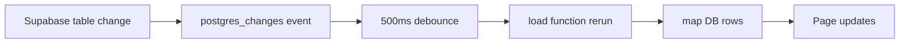
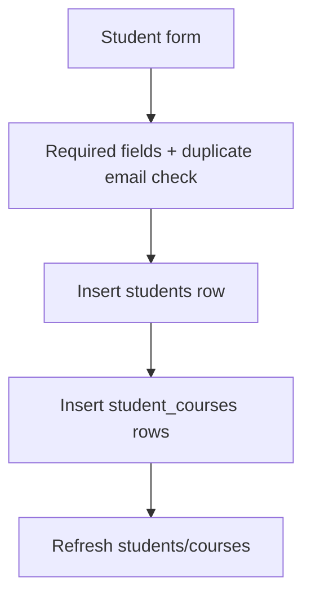

# TDS Management - System Flow

TDS Management ek Next.js App Router based academic services dashboard hai. Is app ka kaam students, courses, issues/tickets, comments, prompts, reports, AI tools usage, settings, users aur roles ko manage karna hai.

Active data source Supabase hai. UI mostly client components mein bani hui hai, data `lib/data/` modules se aata hai, auth Supabase Auth se hoti hai, aur realtime updates Supabase Realtime subscriptions se page refresh karte hain.

## Tech Stack

| Area | Use |
| --- | --- |
| Framework | Next.js 16 App Router |
| UI | React 19, Tailwind CSS, shadcn-style components, lucide icons |
| Database/Auth | Supabase Postgres, Supabase Auth, RLS |
| Realtime | Supabase `postgres_changes` subscriptions |
| Local State | Zustand for global search and toasts |
| Charts | Recharts |
| PDF | `@react-pdf/renderer` |
| PWA | Manifest, icons, service worker registration |

## Quick Start

Install dependencies:

```bash
npm install
```

Supabase database setup:

```bash
psql $DATABASE_URL < supabase/schema.sql
psql $DATABASE_URL < supabase/seed.sql
```

Required environment variables:

```bash
NEXT_PUBLIC_SUPABASE_URL=...
NEXT_PUBLIC_SUPABASE_ANON_KEY=...
SUPABASE_SERVICE_ROLE_KEY=...
```

`SUPABASE_SERVICE_ROLE_KEY` sirf server API routes mein admin user management ke liye use hoti hai. Is key ko browser/client code mein expose nahi karna.

Development server:

```bash
npm run dev
```

App open:

```text
http://localhost:3000
```

First admin bootstrap:

1. Supabase dashboard mein Email auth provider enable karo.
2. Supabase Auth UI se first user create karo.
3. Us user ko app admin role do:

```sql
insert into public.user_roles (user_id, role)
select id, 'admin'
from auth.users
where email = 'admin@example.com'
on conflict (user_id) do update set role = excluded.role;
```

## High-Level Flow

```mermaid
flowchart TD
  Browser[User Browser] --> Middleware[middleware.ts]
  Middleware --> Auth[Supabase Auth Session]
  Auth -- no session --> Login[/login]
  Auth -- session --> Layout[DashboardLayout]
  Layout --> Pages[App Routes]
  Pages --> QueryHook[useSupabaseQuery]
  QueryHook --> DataModules[lib/data modules]
  DataModules --> Supabase[(Supabase DB)]
  Supabase -. realtime changes .-> QueryHook
  QueryHook --> UI[Updated UI]
```

Normal page behavior:

1. User route open karta hai, jaise `/students` ya `/issues`.
2. `middleware.ts` Supabase session check karta hai.
3. Agar login nahi hai to user `/login` par redirect hota hai.
4. Authenticated user dashboard shell mein route dekhta hai.
5. Page `useSupabaseQuery()` call karta hai.
6. Hook `lib/data/*` loader se data fetch karta hai.
7. Data mapper Supabase snake_case rows ko UI-friendly camelCase objects mein convert karta hai.
8. Page table, cards, forms, charts render karta hai.
9. Supabase table mein change aaye to realtime event hook ko refresh karwa deta hai.

## Folder Structure

```text
app/
  api/
    report/[studentId]/pdf/route.ts    Server-side PDF export
    users/route.ts                     Admin user list/invite API
    users/[userId]/route.ts            Admin role update/delete API
  analytics/page.tsx                   Future analytics shell
  comments/page.tsx                    Ticket/comment workspace
  courses/page.tsx                     Course CRUD
  issues/page.tsx                      Issue tracking
  login/page.tsx                       Supabase email login
  prompts/page.tsx                     Prompt template CRUD
  reports/page.tsx                     Reports index
  reports/[studentId]/page.tsx         Student detail report
  settings/page.tsx                    Supabase status + user management
  students/page.tsx                    Student CRUD
  tools/page.tsx                       AI tools metrics CRUD
  layout.tsx                           Root layout, theme boot, PWA, toaster
  manifest.ts                          PWA manifest
  page.tsx                             Dashboard home

components/
  dashboard/charts.tsx                 Dashboard/Recharts components
  issues/new-issue-dialog.tsx          Shared issue creation dialog
  layout/dashboard-layout.tsx          Sidebar, header, global search, notifications
  ui/                                  Shared UI primitives
  pwa-install-button.tsx               Install app button
  pwa-register.tsx                     Service worker registration
  theme-toggle.tsx                     Light/dark toggle

hooks/
  use-mobile.ts                        Mobile viewport helper

lib/
  auth/                                Auth/session/role helpers
  data/                                Supabase data access layer
  supabase.ts                          Browser Supabase client factory
  utils.ts                             Shared className helper

public/
  icons/                               PWA icons
  sw.js                                Service worker

store/
  useSearchStore.ts                    Global search query
  useToastStore.ts                     Toast notifications

supabase/
  schema.sql                           Main database schema
  seed.sql                             Optional seed data
  reset-current-app.sql                Reset helper

middleware.ts                          Route protection and auth redirects
schema.sql                             Root copy of DB schema
SYSTEM_FLOW.md                         Detailed system-flow reference
```

## Route Behavior

| Route | Kya karta hai | Main data |
| --- | --- | --- |
| `/` | Dashboard metrics, charts, recent students | Students, courses, issues, AI tools |
| `/students` | Students list, add/edit/delete, course assignment | `students`, `student_courses`, `courses`, `issues` |
| `/courses` | Courses list, add/edit/delete, enrollment count | `courses`, `student_courses` |
| `/issues` | Student issues list and new issue dialog | `issues`, `students`, `comments` |
| `/comments` | Ticket thread workspace, replies, status updates | `comments`, `issues`, `students` |
| `/prompts` | Prompt templates CRUD, search/filter/copy | `prompts`, `courses` |
| `/reports` | Student report listing | `students`, `issues`, `courses` |
| `/reports/[studentId]` | Full student report with tabs and PDF export | `students`, `issues`, `comments`, `courses` |
| `/tools` | AI tools usage chart/table and CRUD | `ai_tools` |
| `/settings` | Supabase connection status and user management | `user_roles`, Supabase Auth users |
| `/login` | Email/password login | Supabase Auth |
| `/analytics` | Placeholder for future analytics | Currently hidden from sidebar |

## Data Layer

Data ka main kaam `lib/data/` karta hai. Pages direct Supabase queries normally nahi likhti; wo helper functions call karti hain.

| File | Responsibility |
| --- | --- |
| `lib/data/client.ts` | `requireSupabase()`, error normalization, optional text normalization |
| `lib/data/hooks.tsx` | `useSupabaseQuery()`, loading/error UI states, realtime refresh |
| `lib/data/mappers.ts` | DB rows ko UI objects mein map karta hai |
| `lib/data/types.ts` | App entities ke TypeScript types |
| `lib/data/pagination.ts` | Limit/offset pagination helpers |
| `lib/data/students.ts` | Student list/page/create/update/delete |
| `lib/data/courses.ts` | Course list/page/create/update/delete + enrollment count |
| `lib/data/issues.ts` | Issue list/page/create/status update |
| `lib/data/comments.ts` | Comments list/page/create/update/delete |
| `lib/data/prompts.ts` | Prompt list/page/create/update/delete |
| `lib/data/ai-tools.ts` | AI tools metrics list/page/create/update/delete |
| `lib/data/dashboard.ts` | Combined dashboard/report/comment/prompt loaders |

Mutation pattern:

1. UI form validate karta hai.
2. Data helper `assertAdmin()` run karta hai.
3. Supabase write hoti hai.
4. Page `refresh()` call karta hai.
5. Toast success/error show hota hai.
6. Database trigger related derived fields update karta hai.
7. Realtime event subscribed pages ko refresh kar deta hai.

## Supabase Tables

| Table | Kya store hota hai |
| --- | --- |
| `courses` | Course code, title, timestamps |
| `students` | Student profile, email, trainer, notes, progress, derived status/priority |
| `student_courses` | Student aur courses ka many-to-many relation |
| `issues` | Student issue category, description, status, priority, timestamps |
| `comments` | Issue/student thread comments, author name, role, text |
| `prompts` | Prompt title, category, content, tags, optional related course |
| `ai_tools` | AI tool name, description, usage count, active students, related problems, success rate |
| `user_roles` | Auth user ka app role: `admin` ya `viewer` |

Important database behavior:

- `set_updated_at` triggers update hone par `updated_at` fresh rakhte hain.
- Issue create/update/delete par student ka summary sync hota hai.
- Student-role comment related issue ko `Pending` kar sakta hai.
- Student comments student ka `last_update` update karte hain.
- RLS authenticated users ko read allow karta hai.
- RLS writes sirf `admin` role ko allow karta hai.
- Realtime publication app tables par enabled hai.

## Auth and Roles

Authentication Supabase Auth se hoti hai.

`middleware.ts` behavior:

- Static assets, icons, `sw.js`, `_next` files ko pass-through karta hai.
- Env vars missing hon to protected routes `/login` par redirect hoti hain.
- Session missing ho to protected route `/login?next=...` par redirect hoti hai.
- Logged-in user `/login` open kare to `/` par redirect hota hai.

Roles:

| Role | Access |
| --- | --- |
| `admin` | Read, create, update, delete, user management |
| `viewer` | Read-only access |

Role helpers:

- `lib/auth/client.ts`: client session/user/signout helpers.
- `lib/auth/roles.ts`: `getUserRole()` and `assertAdmin()`.
- `lib/auth/server.ts`: API routes ke liye cookie client, service-role client, admin request guard.
- `lib/auth/use-current-user-role.ts`: UI ko current role deta hai.
- `lib/auth/role-utils.ts`: allowed roles and unauthorized message.

## Global Stores

Zustand full app data store ke liye use nahi ho raha. App ka actual data Supabase se aata hai.

| Store | Kya store karta hai | Kahan use hota hai |
| --- | --- | --- |
| `store/useSearchStore.ts` | `searchQuery` string | Dashboard layout search input, searchable pages |
| `store/useToastStore.ts` | Toast list with title, description, type | Mutations ke success/error notifications |

Toast auto-dismiss 5 seconds ke baad hota hai.

## Realtime Refresh

`useSupabaseQuery(load, initialData, realtimeTables, reloadKey)` har subscribed table ke liye Supabase channel banata hai.

Flow:



Realtime tables by surface:

| UI Surface | Realtime Tables |
| --- | --- |
| Dashboard | `students`, `student_courses`, `courses`, `issues`, `comments`, `ai_tools` |
| Students | `students`, `student_courses`, `courses`, `issues` |
| Courses | `courses`, `student_courses` |
| Issues | `issues`, `students`, `comments` |
| Comments/Tickets | `students`, `issues`, `comments` |
| Prompts | `courses`, `prompts` |
| Reports index | `students`, `student_courses`, `courses`, `issues` |
| Student report | `students`, `student_courses`, `courses`, `issues`, `comments` |
| AI Tools Usage | `ai_tools` |
| Dashboard layout notifications | `issues`, `comments` |

## Feature Flows

### Dashboard

Dashboard `getDashboardData()` call karta hai. Ye students, courses, issues aur AI tools parallel load karta hai.

Dashboard show karta hai:

- Total students
- Active courses
- Open issues
- Resolved issues
- Pending reviews
- AI tools usage total
- Issues by category chart
- Resolution progress chart
- Recent students table

### Students

Students page admin ko student create/edit/delete karne deta hai.

Student store hota hai:

- Name
- Email
- Assigned trainer
- Assigned course IDs
- Initial status
- Notes
- Derived issues/status/priority/progress

Create flow:



Initial UI status mapping:

| UI status | Stored `overall_status` |
| --- | --- |
| Active | `In Progress` |
| Inactive | `Pending` |

### Courses

Courses page course code/title manage karta hai.

Course store hota hai:

- Code
- Title
- Created/updated timestamps
- Enrollment count derived from `student_courses`

Duplicate course code create/update se pehle check hota hai.

### Issues

Issues page student problems/tickets track karta hai.

Issue store hota hai:

- Student ID
- Category
- Description
- Status: `Pending`, `In Progress`, `Resolved`, `Escalated`
- Priority: `Low`, `Medium`, `High`, `Critical`

Issue create/update/delete ke baad DB trigger student summary recalculate karta hai.

Status precedence:

| Highest to lowest |
| --- |
| `Escalated` |
| `Pending` |
| `In Progress` |
| `Resolved` |

Priority precedence:

| Highest to lowest |
| --- |
| `Critical` |
| `High` |
| `Medium` |
| `Low` |

### Comments / Tickets

Comments page ticket thread workspace hai.

Comment store hota hai:

- Student ID
- Optional issue ID
- Author name
- Role: `Admin` ya `Student`
- Text
- Timestamps

Important behavior:

- Admin reply ke sath issue status optionally update ho sakta hai.
- Student simulator reply related issue ko `Pending` kar sakta hai.
- Comment edit/delete admin-only mutation path se hota hai.

### Prompts

Prompts page reusable prompt templates manage karta hai.

Prompt store hota hai:

- Title
- Category
- Content
- Tags as `text[]`
- Optional `related_course_id`
- Timestamps

UI search title, content aur tags par kaam karta hai. Prompt content clipboard mein copy ho sakta hai.

### Reports

Reports index har student ka summary show karta hai. Student detail report:

- Student profile
- Assigned courses
- Issue counts
- Open/resolved counts
- Category summary
- Full issue table
- Comment history
- Timeline activity
- AI tools placeholder

PDF export:

```text
/api/report/[studentId]/pdf
```

Ye server route students, issues aur comments load karke `@react-pdf/renderer` se PDF attachment return karta hai.

### AI Tools Usage

Tools page AI tools metrics manage karta hai.

AI tool store hota hai:

- Tool name
- Description
- Usage count
- Active students
- Related problem count
- Success rate

Chart usage count vs related problems show karta hai.

### Settings

Settings page:

- Organization settings read-only show karta hai.
- Supabase connection check karta hai by querying `courses`.
- Admin users list/invite karta hai.
- Admin user roles update karta hai.
- Admin users remove kar sakta hai.

User management API routes service-role key use karti hain, is liye ye kaam browser se direct Supabase admin key expose kiye baghair hota hai.

## UI Shell Behavior

`components/layout/dashboard-layout.tsx` app shell provide karta hai:

- Desktop/mobile sidebar
- Active route highlight
- Global search input
- Open issues notification dot
- Issues sidebar badge
- Theme toggle
- PWA install button
- Current user email and role
- Sign out button

`app/layout.tsx`:

- Metadata and PWA config set karta hai.
- Theme flash avoid karne ke liye initial theme script run karta hai.
- `PwaRegister`, `DashboardLayout`, and `Toaster` mount karta hai.

## PWA Flow

| File | Role |
| --- | --- |
| `app/manifest.ts` | Browser ko app manifest deta hai |
| `public/icons/*` | Install icons |
| `public/sw.js` | Service worker |
| `components/pwa-register.tsx` | Production mein service worker register karta hai |
| `components/pwa-install-button.tsx` | Browser install prompt handle karta hai |

## Common Commands

```bash
npm run dev
npm run build
npm run start
npm run lint
```

## Notes for Developers

- Next.js version current project mein `16.2.6` hai. Is repo ke `AGENTS.md` ke mutabiq Next APIs ke liye `node_modules/next/dist/docs/` check karna zaroori hai before code changes.
- App data ke liye primary source Supabase hai, Zustand nahi.
- Supabase env vars missing hon to pages `requireSupabase()` error dikhayengi.
- Write operations UI mein hidden ho sakti hain for viewers, lekin final security RLS aur `assertAdmin()` se enforce hoti hai.
- Pagination limit/offset based hai.
- Search mostly client-side filter hai, global search input `useSearchStore` mein value rakhta hai.
- `SYSTEM_FLOW.md` mein aur detailed mermaid diagrams aur flow notes available hain.
