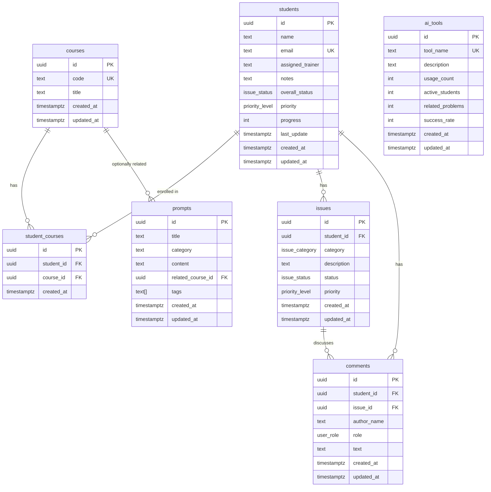

# TDS Management — Complete System Design Document

---

> Legacy note: this document still describes the pre-auth open-access architecture. The current app requires Supabase Auth, approval status checks, and role-based route access. Use `README.md`, `supabase/schema.sql`, and the current `lib/auth/*` implementation as the source of truth until this document is rewritten.

## 1. PROJECT OVERVIEW

**TDS Management** is an academic services admin dashboard built with Next.js 16 (App Router) and Supabase. It allows academic staff to manage students, courses, issues, comments, reusable prompt templates, AI tool directories, workflow guides, and detailed per-student reports — all without requiring any user login or authentication.

The system operates in **open-access mode**: every route renders directly, all role checks resolve to admin, and Supabase Row-Level Security grants full access to anon/authenticated users. The primary data flow is client-side React components → `lib/data/` modules → Supabase REST queries, with real-time Postgres change subscriptions keeping the UI in sync across open browser tabs.

**Target users:** Academic administrators, tutors, and program coordinators who track student progress, manage support tickets, and maintain a library of assignment workflow prompts.

### Tech Stack

| Layer | Technology | Version |
|-------|-----------|---------|
| Framework | Next.js (App Router) | 16.2.6 |
| UI Library | React | 19.2.4 |
| Language | TypeScript | 5.x |
| Styling | Tailwind CSS v4 | ^4 (postcss) |
| UI Components | shadcn/ui (base-nova style) | — |
| Icons | lucide-react | 1.16.0 |
| Charts | Recharts | 3.8.1 |
| State (global) | Zustand | 5.0.13 |
| Database | Supabase (Postgres) | — |
| Realtime | Supabase Realtime (`postgres_changes`) | — |
| PDF | @react-pdf/renderer | 4.5.1 |
| Date formatting | date-fns | 4.2.1 |
| Utility | class-variance-authority, clsx, tailwind-merge | — |
| Animation | tw-animate-css | 1.4.0 |
| PWA | next-pwa (service worker) | — |

---

## 2. ARCHITECTURE OVERVIEW

The system follows a **thin-client** architecture: all business logic lives either in the browser (React state, data-loading hooks) or in the database (triggers, rollup functions). The Next.js server handles only static page serving, API routes for PDF generation and user management, and PWA metadata.

```
┌─────────────────────────────────────────────────────────────────────┐
│                        Browser (Client)                             │
│                                                                     │
│  ┌──────────┐  ┌──────────┐  ┌──────────┐  ┌───────────────────┐  │
│  │  Next.js  │  │  Zustand │  │  Recharts│  │  @react-pdf/render│  │
│  │ App Router│  │  Stores  │  │  Charts  │  │  (via API route)  │  │
│  └────┬─────┘  └──────────┘  └──────────┘  └───────────────────┘  │
│       │                                                             │
│  ┌────▼─────────────────────────────────────────────────────────┐  │
│  │                  lib/data/ Modules                             │  │
│  │  students.ts  courses.ts  issues.ts  comments.ts              │  │
│  │  prompts.ts   ai-tools.ts dashboard.ts                        │  │
│  │  hooks.tsx    mappers.ts  client.ts   pagination.ts           │  │
│  └────┬─────────────────────────────────────────────────────────┘  │
│       │                                                             │
│  ┌────▼─────────────────────────────────────────────────────────┐  │
│  │              lib/auth/ (Open-access shim)                     │  │
│  │  roles.ts → assertAdmin() = no-op                            │  │
│  │  use-current-user-role.ts → { isAdmin: true }                │  │
│  └───────────────────────────────────────────────────────────────┘  │
└──────────────────────┬──────────────────────────────────────────────┘
                       │ HTTP / WebSocket (Supabase Realtime)
                       ▼
┌──────────────────────────────────────────────────────────────────────┐
│                     Supabase (Postgres + REST API)                    │
│                                                                       │
│  Tables:                                                              │
│  students  courses  student_courses  issues  comments                │
│  prompts   ai_tools  user_roles                                      │
│                                                                       │
│  Triggers:                                                            │
│  • set_updated_at — before update on every table                     │
│  • issues_sync_student_{insert,update,delete} → sync_student_issue...│
│  • comments_student_pending → mark_issue_pending_after_student_...  │
│                                                                       │
│  RLS: All tables open to anon + authenticated (open-access mode)    │
└──────────────────────────────────────────────────────────────────────┘
```

**How data moves through the system:**

1. A client page component mounts and calls `useSupabaseQuery(loader, initial, tables)`.
2. The hook invokes a loader function from `lib/data/*.ts` (e.g. `listStudentsPage()`).
3. The loader calls `requireSupabase()` → gets the Supabase browser client → runs a `.select()` / `.insert()` / `.update()` / `.delete()` query.
4. Raw Supabase rows are converted to camelCase UI types via mapper functions in `lib/data/mappers.ts`.
5. The hook sets `data`, `loading`, `error` state and re-renders the component.
6. The hook also subscribes to `postgres_changes` on the specified tables; when a change arrives, it debounces 500ms and calls `refresh()`.
7. Mutations call `create*`, `update*`, or `delete*` helpers, which call `refresh()` and show a success/error toast.

---

## 3. FOLDER STRUCTURE

```
D:\Assignmentwork/
│
├── app/                              # Next.js App Router (12 routes)
│   ├── globals.css                   # Tailwind imports, CSS variables, dark mode
│   ├── layout.tsx                    # Root layout: theme script, metadata, DashboardLayout, Toaster
│   ├── manifest.ts                   # PWA manifest generator
│   ├── page.tsx                      # Route / — Dashboard (client component)
│   │
│   ├── comments/
│   │   └── page.tsx                  # Route /comments — Ticket thread workspace
│   ├── courses/
│   │   └── page.tsx                  # Route /courses — Course CRUD with enrollment
│   ├── issues/
│   │   └── page.tsx                  # Route /issues — Global issue list
│   ├── prompts/
│   │   └── page.tsx                  # Route /prompts — Prompt library with subject-wise cards
│   ├── reports/
│   │   ├── page.tsx                  # Route /reports — Reports index
│   │   └── [studentId]/
│   │       └── page.tsx              # Route /reports/:studentId — Student detail report
│   ├── settings/
│   │   └── page.tsx                  # Route /settings — Supabase status + user mgmt
│   ├── students/
│   │   └── page.tsx                  # Route /students — Student CRUD
│   ├── tools/
│   │   └── page.tsx                  # Route /tools — AI Tools Directory
│   │
│   ├── workflow/                     # Server components, static data
│   │   ├── page.tsx                  # Route /workflow — Workflow library index
│   │   ├── workflow-data.ts          # Static data (cards, steps, prompts)
│   │   ├── [slug]/
│   │   │   └── page.tsx              # Route /workflow/:slug — Detail guides
│   │   └── _components/
│   │       └── copy-workflow-button.tsx  # Clipboard copy with state feedback
│   │
│   └── api/                          # API routes
│       ├── report/
│       │   └── [studentId]/
│       │       └── pdf/
│       │           └── route.ts      # GET — Server-side PDF generation
│       └── users/
│           ├── route.ts              # GET (list users), POST (invite user)
│           └── [userId]/
│               └── route.ts          # DELETE (remove user)
│
├── components/                       # All React components
│   ├── ui/                           # 12 shadcn-style primitives
│   │   ├── avatar.tsx                # <Avatar> with Radix
│   │   ├── badge.tsx                 # <Badge> — 7 variants via cva
│   │   ├── button.tsx                # <Button> — 6 variants, 4 sizes via cva
│   │   ├── card.tsx                  # <Card> + Header/Title/Description/Content/Footer
│   │   ├── dialog.tsx                # <Dialog> with Radix
│   │   ├── input.tsx                 # <Input>
│   │   ├── label.tsx                 # <Label> with Radix
│   │   ├── pagination-controls.tsx   # <PaginationControls> — Previous/Next
│   │   ├── table.tsx                 # <Table> + Header/Body/Row/Cell/Head
│   │   ├── tabs.tsx                  # <Tabs> with Radix
│   │   ├── textarea.tsx              # <Textarea>
│   │   └── toaster.tsx               # <Toaster> — toast display
│   │
│   ├── dashboard/
│   │   └── charts.tsx                # IssueCategoryChart (Bar), ResolutionProgressChart (Pie)
│   ├── issues/
│   │   └── new-issue-dialog.tsx      # Reusable issue creation dialog
│   ├── layout/
│   │   └── dashboard-layout.tsx      # Sidebar + Header + main content shell
│   ├── pwa-install-button.tsx        # Before-install-prompt handler
│   ├── pwa-register.tsx              # Service worker registration
│   └── theme-toggle.tsx              # Light/dark toggle (localStorage)
│
├── lib/                              # Non-component logic
│   ├── supabase.ts                   # createBrowserClient (with null check)
│   ├── utils.ts                      # cn(), getStatusVariant(), getPriorityVariant()
│   │
│   ├── auth/                         # Open-access compatibility layer
│   │   ├── roles.ts                  # assertAdmin() = no-op
│   │   ├── use-current-user-role.ts  # Always returns { isAdmin: true }
│   │   ├── role-utils.ts             # UserRole type, isUserRole()
│   │   └── server.ts                 # createServiceRoleClient() for API routes
│   │
│   └── data/                         # Data access layer
│       ├── ai-tools.ts               # CRUD for ai_tools table
│       ├── client.ts                 # requireSupabase(), getErrorMessage(), normalizeOptionalText()
│       ├── comments.ts               # CRUD for comments table
│       ├── courses.ts                # CRUD for courses table
│       ├── dashboard.ts              # getDashboardData(), getReportsIndexData()
│       ├── hooks.tsx                 # useSupabaseQuery(), LoadingState, ErrorState
│       ├── issues.ts                 # CRUD for issues table
│       ├── mappers.ts                # mapCourse, mapStudent, mapIssue, mapComment, mapPrompt, mapAiTool
│       ├── pagination.ts             # getPaginationRange(), toPaginatedResult()
│       ├── prompts.ts                # CRUD for prompts table
│       ├── students.ts               # CRUD for students table
│       └── types.ts                  # All TypeScript interfaces
│
├── store/                            # Zustand stores
│   ├── useSearchStore.ts             # Global search query (shared across pages)
│   └── useToastStore.ts              # Toast notification queue with auto-dismiss
│
├── supabase/
│   ├── schema.sql                    # Full schema: tables, enums, triggers, RLS, realtime
│   ├── seed.sql                      # Optional seed data placeholder
│   └── reset.sql                     # Drop and recreate
│
├── scripts/
│   └── upsert-approved-tools.mjs     # CLI script to bulk-upsert AI tools
│
├── public/
│   └── icons/                        # PWA icons (192, 512, apple-touch)
│
├── components.json                   # shadcn configuration (style: base-nova)
├── next.config.ts                    # Minimal Next.js config
├── postcss.config.mjs                # @tailwindcss/postcss plugin
├── package.json
├── tsconfig.json
├── AGENTS.md                         # Next.js version-specific rules
├── CLAUDE.md                         # Points to AGENTS.md
├── SYSTEM_FLOW.md                    # Existing system flow documentation
└── systemdesign.md                   # Design system documentation
```

---

## 4. DATABASE SCHEMA

### 4.1 Enums

```sql
CREATE TYPE user_role AS ENUM ('Student', 'Admin');
CREATE TYPE issue_status AS ENUM ('Pending', 'In Progress', 'Resolved', 'Escalated');
CREATE TYPE priority_level AS ENUM ('Low', 'Medium', 'High', 'Critical');
CREATE TYPE issue_category AS ENUM (
  'Prompt Issues', 'Stealth Writer Issues', 'Instructions Issues',
  'Data Extraction Issues', 'Reference Memory Issues', 'Thesis Issues',
  'Remake Required', 'Other'
);
```

### 4.2 Tables

#### `courses`
| Column | Type | Constraints |
|--------|------|-------------|
| `id` | `uuid` | PK, default `gen_random_uuid()` |
| `code` | `text` | NOT NULL, UNIQUE |
| `title` | `text` | NOT NULL |
| `created_at` | `timestamptz` | NOT NULL, default `now()` |
| `updated_at` | `timestamptz` | NOT NULL, default `now()` |

#### `students`
| Column | Type | Constraints |
|--------|------|-------------|
| `id` | `uuid` | PK, default `gen_random_uuid()` |
| `name` | `text` | NOT NULL |
| `email` | `text` | UNIQUE (nullable) |
| `assigned_trainer` | `text` | NOT NULL, default `'Unassigned'` |
| `notes` | `text` | nullable |
| `overall_status` | `issue_status` | NOT NULL, default `'Pending'` |
| `priority` | `priority_level` | NOT NULL, default `'Medium'` |
| `progress` | `integer` | NOT NULL, default `0`, CHECK 0–100 |
| `last_update` | `timestamptz` | NOT NULL, default `now()` |
| `created_at` | `timestamptz` | NOT NULL, default `now()` |
| `updated_at` | `timestamptz` | NOT NULL, default `now()` |

#### `student_courses` (join table)
| Column | Type | Constraints |
|--------|------|-------------|
| `id` | `uuid` | PK, default `gen_random_uuid()` |
| `student_id` | `uuid` | FK → students(id) ON DELETE CASCADE |
| `course_id` | `uuid` | FK → courses(id) ON DELETE CASCADE |
| `created_at` | `timestamptz` | NOT NULL, default `now()` |
| UNIQUE | `(student_id, course_id)` | |

#### `issues`
| Column | Type | Constraints |
|--------|------|-------------|
| `id` | `uuid` | PK, default `gen_random_uuid()` |
| `student_id` | `uuid` | FK → students(id) ON DELETE CASCADE |
| `category` | `issue_category` | NOT NULL |
| `description` | `text` | NOT NULL |
| `status` | `issue_status` | NOT NULL, default `'Pending'` |
| `priority` | `priority_level` | NOT NULL, default `'Medium'` |
| `created_at` | `timestamptz` | NOT NULL, default `now()` |
| `updated_at` | `timestamptz` | NOT NULL, default `now()` |

#### `comments`
| Column | Type | Constraints |
|--------|------|-------------|
| `id` | `uuid` | PK, default `gen_random_uuid()` |
| `student_id` | `uuid` | FK → students(id) ON DELETE CASCADE |
| `issue_id` | `uuid` | FK → issues(id) ON DELETE CASCADE (nullable) |
| `author_name` | `text` | NOT NULL |
| `role` | `user_role` | NOT NULL |
| `text` | `text` | NOT NULL |
| `created_at` | `timestamptz` | NOT NULL, default `now()` |
| `updated_at` | `timestamptz` | NOT NULL, default `now()` |

#### `prompts`
| Column | Type | Constraints |
|--------|------|-------------|
| `id` | `uuid` | PK, default `gen_random_uuid()` |
| `title` | `text` | NOT NULL |
| `category` | `text` | NOT NULL, default `'General'` |
| `content` | `text` | NOT NULL |
| `related_course_id` | `uuid` | FK → courses(id) ON DELETE SET NULL |
| `tags` | `text[]` | NOT NULL, default `'{}'` |
| `created_at` | `timestamptz` | NOT NULL, default `now()` |
| `updated_at` | `timestamptz` | NOT NULL, default `now()` |

#### `ai_tools`
| Column | Type | Constraints |
|--------|------|-------------|
| `id` | `uuid` | PK, default `gen_random_uuid()` |
| `tool_name` | `text` | NOT NULL, UNIQUE |
| `description` | `text` | NOT NULL, default `''` |
| `usage_count` | `integer` | NOT NULL, default 0, CHECK >= 0 |
| `active_students` | `integer` | NOT NULL, default 0, CHECK >= 0 |
| `related_problems` | `integer` | NOT NULL, default 0, CHECK >= 0 |
| `success_rate` | `integer` | NOT NULL, default 100, CHECK 0–100 |
| `created_at` | `timestamptz` | NOT NULL, default `now()` |
| `updated_at` | `timestamptz` | NOT NULL, default `now()` |

#### `user_roles`
| Column | Type | Constraints |
|--------|------|-------------|
| `user_id` | `uuid` | PK, FK → auth.users(id) ON DELETE CASCADE |
| `role` | `text` | NOT NULL, CHECK IN ('admin', 'viewer') |
| `created_at` | `timestamptz` | NOT NULL, default `now()` |
| `updated_at` | `timestamptz` | NOT NULL, default `now()` |

### 4.3 Entity Relationship Diagram



### 4.4 Database Triggers

| Trigger | Timing | Function | Purpose |
|---------|--------|----------|---------|
| `courses_set_updated_at` | BEFORE UPDATE on courses | `set_updated_at()` | Sets `updated_at = now()` |
| `students_set_updated_at` | BEFORE UPDATE on students | `set_updated_at()` | Same |
| `issues_set_updated_at` | BEFORE UPDATE on issues | `set_updated_at()` | Same |
| `comments_set_updated_at` | BEFORE UPDATE on comments | `set_updated_at()` | Same |
| `prompts_set_updated_at` | BEFORE UPDATE on prompts | `set_updated_at()` | Same |
| `ai_tools_set_updated_at` | BEFORE UPDATE on ai_tools | `set_updated_at()` | Same |
| `user_roles_set_updated_at` | BEFORE UPDATE on user_roles | `set_updated_at()` | Same |
| `issues_sync_student_insert` | AFTER INSERT on issues | `sync_student_after_issue_change()` | Recalculates student's overall_status, priority, last_update |
| `issues_sync_student_update` | AFTER UPDATE on issues | `sync_student_after_issue_change()` | Same |
| `issues_sync_student_delete` | AFTER DELETE on issues | `sync_student_after_issue_change()` | Same (operates on OLD.student_id) |
| `comments_student_pending` | AFTER INSERT on comments | `mark_issue_pending_after_student_comment()` | Sets related issue to Pending when role=Student; updates student's last_update |

### 4.5 RLS Policies

All 7 app tables (`courses`, `students`, `student_courses`, `issues`, `comments`, `prompts`, `ai_tools`) have a single policy:

```sql
CREATE POLICY "Allow public app access"
  ON <table> FOR ALL TO anon, authenticated
  USING (true) WITH CHECK (true);
```

The `user_roles` table has a similar open policy.

### 4.6 Indexes

```sql
idx_student_courses_student_id    ON student_courses(student_id)
idx_student_courses_course_id     ON student_courses(course_id)
idx_issues_student_id             ON issues(student_id)
idx_issues_status                 ON issues(status)
idx_comments_student_id           ON comments(student_id)
idx_comments_issue_id             ON comments(issue_id)
idx_prompts_category              ON prompts(category)
idx_prompts_related_course_id     ON prompts(related_course_id)
```

### 4.7 Realtime Publication

```sql
ALTER PUBLICATION supabase_realtime SET TABLE
  courses, students, student_courses, issues,
  comments, prompts, ai_tools, user_roles;
```

---

## 5. DATA FLOW

### 5.1 The `useSupabaseQuery` Hook

**File:** `lib/data/hooks.tsx`

```typescript
function useSupabaseQuery<T>(
  load: () => Promise<T>,        // Data loader function
  initialData: T,                // Default value (used before first load)
  realtimeTables: string[],      // Tables to subscribe to
  reloadKey?: string             // Re-fetches when this key changes
): { data, loading, error, refresh }
```

**Lifecycle:**

```
Component mounts
  ↓
useEffect calls refresh()
  ↓
loader function runs (e.g. listStudentsPage())
  ↓
sets loading=true, error=null
  ↓
on success: sets data, loading=false
on error: sets error message, loading=false
  ↓
Second useEffect: subscribes to postgres_changes on each table
  ↓
When a DB change arrives → debounce 500ms → calls refresh()
  ↓
Component re-renders with fresh data
```

### 5.2 Mutation Flow

```
User clicks "Save" in dialog
  ↓
Form validation (client-side: required fields, duplicate email/code checks)
  ↓
createStudent / updateStudent / deleteStudent() in lib/data/*.ts
  ↓
assertAdmin() — no-op, passes through
  ↓
requireSupabase() → supabase.insert/update/delete()
  ↓
Database triggers fire (student summary sync)
  ↓
Mutation function returns
  ↓
Page calls refresh() — re-fetches all data
  ↓
Realtime subscription fires in other tabs (if any)
  ↓
Toast notification shown: success or error
```

### 5.3 Realtime Subscription Map

| Page | Subscribed Tables |
|------|-------------------|
| Dashboard `/` | `students`, `student_courses`, `courses`, `issues`, `comments` |
| Students `/students` | `students`, `student_courses`, `courses`, `issues` |
| Courses `/courses` | `courses`, `student_courses` |
| Issues `/issues` | `issues`, `students`, `comments` |
| Comments `/comments` | `students`, `issues`, `comments` |
| Prompts `/prompts` | `courses`, `prompts` |
| Reports `/reports` | `students`, `student_courses`, `courses`, `issues` |
| Report detail `/reports/[id]` | `students`, `student_courses`, `courses`, `issues`, `comments` |
| Tools `/tools` | `ai_tools` |
| Workflow `/workflow/*` | None (static server components) |
| Settings `/settings` | None (mount-only check) |

### 5.4 Error Handling Flow

```
Loader throws error
  ↓
getErrorMessage(error) in lib/data/client.ts
  ├── if Error instance → error.message
  └── else → "Something went wrong while contacting Supabase."
  ↓
ErrorState component renders:
  ┌─────────────────────────────────────┐
  │  Unable to load data                │
  │  {error message}                    │
  │  [Try again] ← calls refresh()      │
  └─────────────────────────────────────┘
```

---

## 6. AUTHENTICATION & AUTHORIZATION

The system intentionally has **no authentication**. It operates in "open workspace" mode.

### 6.1 Client-Side Role

**`lib/auth/use-current-user-role.ts`:**
```typescript
export function useCurrentUserRole() {
  return { role: "admin", loading: false, isAdmin: true };
}
```

This is consumed by all pages to conditionally show/hide mutation buttons (Add, Edit, Delete). The `isAdmin` boolean gates all CRUD UI.

### 6.2 Server-Side Assertion

**`lib/auth/roles.ts`:**
```typescript
export async function assertAdmin() { return null; } // No-op
```

Every mutation function in `lib/data/*.ts` calls `await assertAdmin()` before proceeding. In the current open-access mode, this immediately resolves. In a future authenticated mode, this would throw an `Unauthorized` error.

### 6.3 API Route Auth

**`lib/auth/server.ts`** creates a Supabase service-role client for API routes. The `requireAdminRequest()` function returns a hardcoded `{ user: { id: "open-access" }, supabase: serviceClient }`.

### 6.4 Supabase RLS

All tables have open policies (`FOR ALL TO anon, authenticated USING (true)`). No actual auth checks at the database level.

### 6.5 Role Compatibility

The `user_roles` table and `role-utils.ts` exist as legacy auth infrastructure. The `isUserRole()` function validates role values, but the dashboard never calls Supabase Auth to verify sessions.

---

## 7. PAGE/ROUTE MAP

### 7.1 Dashboard — `/`

| Property | Value |
|----------|-------|
| Type | Client component |
| Data loader | `getDashboardData()` → parallel fetch: `listStudents()`, `listCourses()`, `listIssues()` |
| Mutations | None (read-only) |
| Realtime | `students`, `student_courses`, `courses`, `issues`, `comments` |
| Key UI | 5 stat cards, 2 Recharts charts (bar + donut), recent students table |

### 7.2 Students — `/students`

| Property | Value |
|----------|-------|
| Type | Client component |
| Data loader | `listStudentsPage({ page, pageSize: 10 })` + `listCourses()` |
| Mutations | `createStudent()`, `updateStudent()`, `deleteStudent()` — via dialog forms |
| Realtime | `students`, `student_courses`, `courses`, `issues` |
| Key UI | Paginated table, search, create/edit/delete dialogs, course toggle chips |

### 7.3 Courses — `/courses`

| Property | Value |
|----------|-------|
| Type | Client component |
| Data loader | `listCoursesWithEnrollmentPage({ page, pageSize: 10 })` |
| Mutations | `createCourse()`, `updateCourse()`, `deleteCourse()` |
| Realtime | `courses`, `student_courses` |
| Key UI | Paginated table with enrollment count, duplicate code prevention |

### 7.4 Issues — `/issues`

| Property | Value |
|----------|-------|
| Type | Client component |
| Data loader | `listIssuesPage({ page, pageSize: 10 })` |
| Mutations | `createIssue()` via `NewIssueDialog` shared component |
| Realtime | `issues`, `students`, `comments` |
| Key UI | Paginated table, status/priority badges, global search filtering |

### 7.5 Comments/Tickets — `/comments`

| Property | Value |
|----------|-------|
| Type | Client component |
| Data loader | `listStudents()`, `listIssues()`, `listCommentsPage({ issueId, page, pageSize: 10 })` |
| Mutations | `createComment()`, `updateComment()`, `deleteComment()`, `updateIssueStatus()` |
| Realtime | `students`, `issues`, `comments` |
| Key UI | Split-panel: issue list (left) + comment thread (right), reply as Admin/Student, optional status update on admin reply, edit/delete comments |

### 7.6 Prompts — `/prompts`

| Property | Value |
|----------|-------|
| Type | Client component |
| Data loader | `listPromptsPage({ page, pageSize: 10 })` + `listCourses()` |
| Mutations | `createPrompt()`, `updatePrompt()`, `deletePrompt()` |
| Realtime | `courses`, `prompts` |
| Key UI | Subject-wise prompt cards (7 pre-built), collapsible writing-style card, paginated prompt table with preview panel, clipboard copy, category filter, tag badges |

### 7.7 Reports Index — `/reports`

| Property | Value |
|----------|-------|
| Type | Client component |
| Data loader | `getReportsIndexData()` → parallel: `listStudents()`, `listIssues()` |
| Mutations | None |
| Realtime | `students`, `student_courses`, `courses`, `issues` |
| Key UI | Searchable student table with open-issue count, link to detail report |

### 7.8 Student Report — `/reports/[studentId]`

| Property | Value |
|----------|-------|
| Type | Client component (uses `use(params)` for async params) |
| Data loader | `listStudentById(studentId)`, `listIssuesByStudentId(studentId)`, `listCommentsByStudentId(studentId)` |
| Mutations | None (read-only) |
| Realtime | `students`, `student_courses`, `courses`, `issues`, `comments` |
| Key UI | Tabs: Overview, Issues, Comments, Progress; PDF export button |
| PDF Export | `GET /api/report/:studentId/pdf` — server-side PDF with `@react-pdf/renderer` |

### 7.9 AI Tools Directory — `/tools`

| Property | Value |
|----------|-------|
| Type | Client component |
| Data loader | `listAiTools()` |
| Mutations | `createAiTool()`, `updateAiTool()`, `deleteAiTool()` |
| Realtime | `ai_tools` |
| Key UI | Sectioned card grid (General / Writing / Stealth), hover-reveal admin actions, auto-linked URLs in descriptions, ordered by predefined `GENERAL_TOOL_ORDER` / `WRITING_TOOL_ORDER` / `STEALTH_TOOL_ORDER` |

### 7.10 Workflow Index — `/workflow`

| Property | Value |
|----------|-------|
| Type | Server component |
| Data loader | Static import from `workflow-data.ts` |
| Mutations | None |
| Realtime | None |
| Key UI | 2-column card grid with icons, category badges, CTAs linking to `/workflow/:slug` |

### 7.11 Workflow Detail — `/workflow/[slug]`

| Property | Value |
|----------|-------|
| Type | Server component with `generateStaticParams` |
| Data loader | Static import from `workflow-data.ts` |
| Mutations | None (clipboard copy via client component `CopyWorkflowButton`) |
| Realtime | None |
| Key UI | Step cards, prompt blocks with copy button, placeholder token guide table |
| Pre-rendered slugs | `unknown-assignment-workflow`, `tools-installation-workflow`, `standard-academic-assignment-workflow`, `master-assignment-prompt` |

### 7.12 Settings — `/settings`

| Property | Value |
|----------|-------|
| Type | Client component |
| Data loader | Runtime Supabase connection check (SELECT id FROM courses LIMIT 1) |
| Mutations | User invite via API route |
| Realtime | None |
| Key UI | Connection status indicator (green/red), user management table with invite/delete |

---

## 8. COMPONENT SYSTEM

### 8.1 UI Primitives (12 components in `components/ui/`)

| Component | Props | Notes |
|-----------|-------|-------|
| `Card` | `className` | Wrapper: `rounded-lg border ...` |
| `CardHeader` | `className` | `flex flex-col space-y-1.5 p-5 sm:p-6` |
| `CardTitle` | `className` | `text-base font-semibold leading-6 tracking-tight sm:text-lg` |
| `CardDescription` | `className` | `text-sm text-zinc-500 dark:text-zinc-400` |
| `CardContent` | `className` | `p-5 pt-0 sm:p-6 sm:pt-0` |
| `CardFooter` | `className` | `flex items-center p-5 pt-0 sm:p-6 sm:pt-0` |
| `Button` | `variant`, `size`, `asChild` | 6 variants × 4 sizes via `cva`; supports `asChild` via Radix Slot |
| `Badge` | `variant` | 7 variants via `cva`: default, secondary, destructive, outline, pending, success, info |
| `Dialog` | Radix set (Portal, Overlay, Content, Header, Footer, Title, Description, Close) | Full CRUD dialog pattern |
| `Table` | Radix set (Header, Body, Row, Head, Cell) | Consistent data table primitive |
| `Tabs` | `TabsList`, `TabsTrigger`, `TabsContent` | Radix tabs for report detail |
| `Input` | standard HTML input props | Styled with light/dark states |
| `Textarea` | standard HTML textarea props | Styled with light/dark states |
| `Label` | Radix label | With `cva` styling |
| `Avatar` | Radix (Image, Fallback) | Used in comment threads |
| `PaginationControls` | `page`, `pageSize`, `total`, `onPageChange` | Previous/Next buttons with "Showing X-Y of Z" |
| `Toaster` | — | Reads `useToastStore`, renders fixed-bottom-right stack |

### 8.2 Shared Custom Components

| Component | Location | Props | Used In |
|-----------|----------|-------|---------|
| `DashboardLayout` | `components/layout/dashboard-layout.tsx` | `{ children }` | Root layout |
| `ThemeToggle` | `components/theme-toggle.tsx` | — | DashboardLayout header |
| `NewIssueDialog` | `components/issues/new-issue-dialog.tsx` | `{ onSaved }` | `/issues`, `/comments` |
| `IssueCategoryChart` | `components/dashboard/charts.tsx` | `{ data: ChartDatum[] }` | Dashboard |
| `ResolutionProgressChart` | `components/dashboard/charts.tsx` | `{ data: ChartDatum[] }` | Dashboard |
| `CopyWorkflowButton` | `app/workflow/_components/` | `{ text, label }` | Workflow detail |
| `PwaInstallButton` | `components/pwa-install-button.tsx` | — | DashboardLayout header |
| `PwaRegister` | `components/pwa-register.tsx` | — | Root layout |
| `LoadingState` | `lib/data/hooks.tsx` | `{ label? }` | All data pages |
| `ErrorState` | `lib/data/hooks.tsx` | `{ message, onRetry }` | All data pages |

### 8.3 Component Hierarchy

```mermaid
flowchart TD
  RootLayout --> PwaRegister
  RootLayout --> DashboardLayout
  RootLayout --> Toaster

  DashboardLayout --> Header
  DashboardLayout --> Sidebar
  DashboardLayout --> MainContent

  Header --> PwaInstallButton
  Header --> ThemeToggle
  Header --> NotificationBell

  Sidebar --> NavLink[Dashboard / Students / Courses / Issues / Comments / Prompts / Reports / Tools / Workflow / Settings]

  MainContent --> PageRouter{Next.js Route}
  PageRouter --> DashboardPage
  PageRouter --> StudentsPage
  PageRouter --> CoursesPage
  PageRouter --> IssuesPage
  PageRouter --> CommentsPage
  PageRouter --> PromptsPage
  PageRouter --> ReportsIndex
  PageRouter --> StudentReport
  PageRouter --> ToolsPage
  PageRouter --> WorkflowIndex
  PageRouter --> WorkflowDetail
  PageRouter --> SettingsPage

  DashboardPage --> StatCards[5x Card]
  DashboardPage --> Charts[IssueCategoryChart + ResolutionProgressChart]
  DashboardPage --> RecentTable[Card > Table]

  StudentsPage --> SearchCard[Card > Search + Table + Pagination]
  StudentsPage --> StudentDialog[Dialog > Form]
  StudentsPage --> DeleteDialog[Dialog > Confirm]

  IssuesPage --> IssuesTable[Card > Table + Pagination]
  IssuesPage --> NewIssueDialog

  CommentsPage --> IssueList[Left panel]
  CommentsPage --> CommentThread[Right panel]
  CommentThread --> ReplyForm
  CommentThread --> EditDialog
  CommentThread --> DeleteDialog

  PromptsPage --> WritingStyleCard[Card > Collapsible]
  PromptsPage --> SubjectPrompts[Card > Card grid]
  PromptsPage --> PromptsTable[Card > Table + Pagination]
  PromptsPage --> PreviewCard[Card > Preview panel]
  PromptsPage --> PromptDialog[Dialog > Form]

  ToolsPage --> ToolSections[Section > Card grid × sections]
  ToolsPage --> ToolDialog[Dialog > Form]

  WorkflowIndex --> WorkflowCard[Card grid × 4]
  WorkflowDetail --> StepCard[Card × steps]
  WorkflowDetail --> PromptBlock[Card > pre + CopyWorkflowButton]
```



---

## 9. STATE MANAGEMENT

### 9.1 Zustand Stores

#### `useSearchStore` (`store/useSearchStore.ts`)

```typescript
interface SearchStore {
  searchQuery: string;
  setSearchQuery: (query: string) => void;
}
```

**Purpose:** Holds a global search string that can be set from the sidebar header and read by any page to filter data client-side. Currently, the search input appears on individual pages (not a persistent global search bar), so this store is wired up but pages also maintain their own local `searchTerm` state.

**Connected components:** Students page, Issues page, Prompts page (all filter by both local and global search).

#### `useToastStore` (`store/useToastStore.ts`)

```typescript
interface Toast {
  id: string;
  title: string;
  description?: string;
  type?: 'success' | 'error' | 'info';
}

interface ToastStore {
  toasts: Toast[];
  addToast: (toast: Omit<Toast, 'id'>) => void;  // auto-dismiss after 5s
  removeToast: (id: string) => void;
}
```

**Purpose:** Global toast notification queue. Any mutation function can call `useToastStore.getState().addToast(...)` to show a notification. The `<Toaster />` component subscribes and renders the stack.

**Connected components:** All pages that perform mutations. `<Toaster />` in root layout.

### 9.2 Local State

All other state lives in local React state via `useState` and `useMemo`:

- **Dialog open/close** — each CRUD page manages its own dialog visibility.
- **Form fields** — each dialog has its own form state (reset on close).
- **Selected issue** — Comments page manages `selectedIssueId` locally.
- **Page number** — each paginated page manages its own page counter.
- **Search term** — each page manages its own local search input.
- **Filter selection** — Prompts page manages category/subject filter locally.

### 9.3 Data State

Data fetching state (`data`, `loading`, `error`, `refresh`) is managed by `useSupabaseQuery` using `useState` + `useRef` internally. There is no global data store — each page fetches its own data.

---

## 10. API ROUTES

### 10.1 PDF Export — `GET /api/report/[studentId]/pdf`

**File:** `app/api/report/[studentId]/pdf/route.ts`

| Property | Value |
|----------|-------|
| Method | `GET` |
| Input | `studentId` URL param |
| Internal | Loads student, issues, comments server-side from Supabase (service role) |
| Output | `application/pdf` attachment via `@react-pdf/renderer` |
| Libraries | `@react-pdf/renderer` (Document, Page, View, Text, StyleSheet) |

### 10.2 User Management — `GET /api/users`

| Property | Value |
|----------|-------|
| Method | `GET` |
| Internal | Calls `supabase.auth.admin.listUsers()` via service role client |
| Output | JSON array of users (id, email, role, created_at, last_sign_in_at) |

### 10.3 User Invite — `POST /api/users`

| Property | Value |
|----------|-------|
| Method | `POST` |
| Body | `{ email: string, role: "admin" \| "viewer" }` |
| Internal | `supabase.auth.admin.inviteUserByEmail()`, then inserts into `user_roles` |
| Output | JSON `{ user }` |

### 10.4 User Delete — `DELETE /api/users/[userId]`

| Property | Value |
|----------|-------|
| Method | `DELETE` |
| Internal | Deletes from `user_roles`, then `supabase.auth.admin.deleteUser()` |
| Output | JSON `{ success: true }` |

---

## 11. DESIGN SYSTEM

### 11.1 Color Tokens

#### Surfaces

| Token | Light | Dark | CSS Class Pattern |
|-------|-------|------|-------------------|
| Page bg | `#f6f7f9` | `#09090b` | `bg-[#f6f7f9]` / `dark:bg-zinc-950` |
| Card bg | `white / 95%` | `zinc-950 / 90%` | `bg-white/95` / `dark:bg-zinc-950/90` |
| Card border | `zinc-200 / 80%` | `zinc-800 / 80%` | `border-zinc-200/80` |
| Sidebar bg | `white / 95%` | `zinc-950 / 95%` | `bg-white/95` / `dark:bg-zinc-950/95` |
| Header bg | `white / 90%` | `zinc-950 / 85%` | `bg-white/90` / `dark:bg-zinc-950/85` |
| Overlay | `zinc-950/45` | — | `bg-zinc-950/45 backdrop-blur-sm` |

#### Text

| Token | Light | Dark |
|-------|-------|------|
| Primary | `zinc-950` | `zinc-50` |
| Secondary | `zinc-600` / `zinc-700` | `zinc-300` / `zinc-400` |
| Muted | `zinc-500` | `zinc-400` |
| Placeholder | `zinc-400` | `zinc-500` |

#### Interactive

| Element | Light | Dark |
|---------|-------|------|
| Button default bg | `zinc-900` | `zinc-50` |
| Button default text | `zinc-50` | `zinc-900` |
| Button default hover | `zinc-800` | `zinc-200` |
| Button outline border | `zinc-200` | `zinc-800` |
| Focus ring | `zinc-950` | `zinc-300` |
| Sidebar active bg | `zinc-950` | `zinc-50` |
| Sidebar inactive text | `zinc-600` | `zinc-400` |

### 11.2 Typography Scale

| Element | Class | Size |
|---------|-------|------|
| Page title | `text-3xl font-bold tracking-tight` | 30px / 2.25rem |
| Section title | `text-xl font-semibold tracking-tight` | 20px / 1.25rem |
| Card title | `text-base font-semibold leading-6 tracking-tight sm:text-lg` | 16px (18px sm) |
| Body | `text-sm leading-6` | 14px |
| Description | `text-sm text-zinc-500` | 14px |
| Small | `text-xs` | 12px |
| Badge text | `text-xs font-semibold` | 12px |
| Pre/code | `text-sm leading-6 (or leading-7)` | 14px |

### 11.3 Spacing

| Context | Value |
|---------|-------|
| Page gap | `gap-8` (32px) |
| Content max width | `max-w-7xl` (1280px) |
| Page padding | `p-4 sm:p-6 lg:p-8` |
| Card padding | `p-5 sm:p-6` |
| Card header/content/footer padding | same as Card |
| Form grid gap | `gap-4 py-6` |
| Form field gap | `gap-2` |
| Grid gutters | `gap-4` (stats) / `gap-6` (sections) |

### 11.4 Component Variants

#### Button (`components/ui/button.tsx`)

6 variants: `default`, `destructive`, `outline`, `secondary`, `ghost`, `link`
4 sizes: `default` (h-10), `sm` (h-9), `lg` (h-11), `icon` (h-10 w-10)
All: `rounded-lg text-sm font-medium`

#### Badge (`components/ui/badge.tsx`)

7 variants: `default`, `secondary`, `destructive`, `outline`, `pending` (yellow), `success` (emerald), `info` (blue)
All: `inline-flex items-center rounded-full px-2.5 py-0.5 text-xs font-semibold`

#### Utility mappings (`lib/utils.ts`)

```typescript
getStatusVariant("Resolved") → "success"     // emerald
getStatusVariant("In Progress") → "info"      // blue
getStatusVariant("Pending") → "pending"       // yellow
getStatusVariant("Escalated") → "destructive" // red

getPriorityVariant("Critical") → "destructive"
getPriorityVariant("High") → "default"        // zinc-900
getPriorityVariant("Medium") → "secondary"    // zinc-100
getPriorityVariant("Low") → "outline"
```

### 11.5 Dark Mode Implementation

- **Strategy:** CSS class-based via `.dark` on `<html>`.
- **Registration:** `@custom-variant dark (&:where(.dark, .dark *))` in `globals.css`.
- **Persistence:** `localStorage` key `tds-management-theme`.
- **Bootstrapping:** Inline `<script>` in `RootLayout` reads before first paint to prevent flash.
- **Toggle:** `<ThemeToggle />` component adds/removes `.dark` and updates localStorage.

---

## 12. KEY BUSINESS LOGIC

### 12.1 Student Status Sync

When an issue is inserted, updated, or deleted, the database trigger `issues_sync_student_{insert,update,delete}` calls `sync_student_after_issue_change()`, which calls `sync_student_issue_summary(student_id)`.

**Status precedence** (highest wins):
1. `Escalated`
2. `Pending`
3. `In Progress`
4. `Resolved` (fallback when no issues remain)

**Priority precedence** (highest wins):
1. `Critical`
2. `High`
3. `Medium`
4. `Low` (fallback when no issues remain)

```sql
-- Simplified logic from sync_student_issue_summary()
SELECT
  CASE
    WHEN COUNT(*) FILTER (WHERE status = 'Escalated') > 0 THEN 'Escalated'
    WHEN COUNT(*) FILTER (WHERE status = 'Pending') > 0 THEN 'Pending'
    WHEN COUNT(*) FILTER (WHERE status = 'In Progress') > 0 THEN 'In Progress'
    ELSE 'Resolved'
  END,
  CASE
    WHEN COUNT(*) FILTER (WHERE priority = 'Critical') > 0 THEN 'Critical'
    WHEN COUNT(*) FILTER (WHERE priority = 'High') > 0 THEN 'High'
    WHEN COUNT(*) FILTER (WHERE priority = 'Medium') > 0 THEN 'Medium'
    ELSE 'Low'
  END
FROM issues WHERE student_id = target_student_id;
```

The function also sets `last_update = now()` and `updated_at = now()` on the student record.

### 12.2 Comment → Issue Status Trigger

When a comment is inserted with `role = 'Student'` and `issue_id IS NOT NULL`, the trigger `comments_student_pending` calls `mark_issue_pending_after_student_comment()`:

```sql
IF new.role = 'Student' AND new.issue_id IS NOT NULL THEN
  UPDATE issues SET status = 'Pending', updated_at = now()
  WHERE id = new.issue_id;
END IF;

UPDATE students SET last_update = now(), updated_at = now()
WHERE id = new.student_id;
```

This means: when a student replies to a ticket, the issue is automatically set back to `Pending` (needs attention).

### 12.3 UI Status Mapping (Student Creation)

| Dialog selection | Stored `overall_status` |
|-----------------|------------------------|
| Active | `In Progress` |
| Inactive | `Pending` |

### 12.4 AI Tool Section Ordering

Tools on the `/tools` page are sorted by a predefined ordered list rather than alphabetically:

| Section | Tool Order |
|---------|-----------|
| General | ChatGPT, Claude Opus, Google Gemini, Grok, Perplexity, Google AI Studio, LMArena |
| Writing | Custom GPT AI Humanizer, HumanizeAI Pro, SuperHumanizer AI, WriteHuman AI, GPTHuman AI, WalterWrites, AuraWrite AI, DigitalMagicWand |
| Stealth | StealthWriter, StealthGPT, Undetectable AI, BypassGPT |

---

## 13. THIRD-PARTY INTEGRATIONS

### 13.1 Supabase

| Feature | Usage | Details |
|---------|-------|---------|
| Database | 8 tables (courses, students, student_courses, issues, comments, prompts, ai_tools, user_roles) | Full CRUD via REST |
| Realtime | `postgres_changes` subscriptions on 7 tables | 500ms debounced auto-refresh |
| Auth | Not used (open access) | Service role client used for API routes only |
| Client | `createBrowserClient()` from `@supabase/ssr` | Null-safe wrapper in `lib/supabase.ts` |

### 13.2 Recharts

- **Bar chart** (`IssueCategoryChart`): Issues grouped by category, monochrome bars (`#18181b` / `dark:fill-zinc-50`).
- **Pie/donut chart** (`ResolutionProgressChart`): Issue status distribution, 7-color palette `["#0088FE", "#00C49F", "#FFBB28", ...]`.
- Dynamically imported with SSR disabled (`dynamic(() => import(...), { ssr: false })`).

### 13.3 shadcn/ui + Radix Primitives

The UI primitives follow the shadcn/ui pattern (`components/ui/*.tsx`) with `cva`-based variants and `cn()` class merging. Underlying Radix packages:

| Primitive | Radix Package |
|-----------|---------------|
| Dialog | `@radix-ui/react-dialog` |
| Tabs | `@radix-ui/react-tabs` |
| Avatar | `@radix-ui/react-avatar` |
| Label | `@radix-ui/react-label` |
| Slot (asChild) | `@radix-ui/react-slot` |
| Toast | `@radix-ui/react-toast` (custom wrapper) |

Style variant: `base-nova` (configured in `components.json`).

### 13.4 @react-pdf/renderer

Used server-side in `app/api/report/[studentId]/pdf/route.ts`. Loads student data with a service-role Supabase client, renders a styled PDF document with student info, issues table, and comment history.

### 13.5 PWA

- **Manifest:** Generated dynamically in `app/manifest.ts` — outputs `/manifest.webmanifest`.
- **Service Worker:** Registered in production via `components/pwa-register.tsx`.
- **Install Button:** `components/pwa-install-button.tsx` handles `beforeinstallprompt`.
- **Apple:** iOS standalone mode via `apple-touch-icon`, `apple-mobile-web-app-capable`, and `viewport-fit=cover`.

---

## 14. PERFORMANCE CONSIDERATIONS

### 14.1 SSR vs CSR

| Type | Pages | Reason |
|------|-------|--------|
| Server components | `/workflow`, `/workflow/[slug]` | Static data from `workflow-data.ts`, no interactivity needed |
| Client components | All other pages | Use React state, `useSupabaseQuery`, event handlers, clipboard API, Recharts |

### 14.2 Dynamic Imports

```typescript
// app/page.tsx — charts are CSR-only (browser rendering)
const IssueCategoryChart = dynamic(
  () => import("@/components/dashboard/charts").then(mod => mod.IssueCategoryChart),
  { ssr: false, loading: ChartPlaceholder }
);
```

### 14.3 Pagination Strategy

All list pages use **offset-based server-side pagination** via Supabase `.range(from, to)`:

| Page | Page Size |
|------|-----------|
| Students | 10 |
| Courses | 10 |
| Issues | 10 |
| Comments | 10 |
| Prompts | 10 |

The `PaginationControls` component shows Previous/Next buttons with "Showing X-Y of Z" and "Page N of M" indicators. It uses `React.memo` to avoid unnecessary re-renders.

### 14.4 Debouncing

Realtime updates are debounced at 500ms:

```typescript
// In useSupabaseQuery
debounceTimerRef.current = setTimeout(() => {
  debounceTimerRef.current = null;
  void refresh();
}, 500);
```

### 14.5 Static Generation

```typescript
// app/workflow/[slug]/page.tsx
export function generateStaticParams() {
  return workflowCards.map(workflow => ({ slug: workflow.slug }));
}
```

The four workflow detail pages are pre-rendered at build time.

---

## 15. KNOWN LIMITATIONS & FUTURE IMPROVEMENTS

### 15.1 Incomplete Features

| Feature | Status | Notes |
|---------|--------|-------|
| Analytics route | Route shell exists, hidden from sidebar | No real Supabase aggregates implemented |
| AI tool metrics | Columns exist in DB, form shows them | No usage/student/problem tracking UI yet |
| Global search | `useSearchStore` wired but unused from sidebar | Each page has its own search input |
| Supabase Auth | `lib/auth/*` is a no-op shim | App works without login, but no multi-user support |

### 15.2 Hardcoded Values

| Location | What's hardcoded | Suggestion |
|----------|-----------------|------------|
| `app/tools/page.tsx` | `GENERAL_TOOL_ORDER`, `WRITING_TOOL_ORDER`, `STEALTH_TOOL_ORDER` arrays | Add a `sort_order` column to `ai_tools` table |
| `app/workflow/workflow-data.ts` | All 4 workflow prompts and guide content | Move to CMS or Supabase |
| `lib/auth/use-current-user-role.ts` | `{ role: "admin", isAdmin: true }` | Implement actual session-based auth |
| `app/prompts/page.tsx` | `subjectWisePrompts` array (7 pre-built prompts) | Store as DB records or use CMS |
| `app/prompts/page.tsx` | `PROMPT_CATEGORIES` and `SUBJECT_PROMPT_FILTERS` arrays | Derive from DB distinct values |
| `scripts/upsert-approved-tools.mjs` | Static tool list | Move to seed data or admin panel |

### 15.3 Suggested Improvements

1. **Authentication** — Replace the open-access shim with real Supabase Auth (magic link or email/password) and enforce RLS per user role.
2. **Global search bar** — Wire the sidebar search input in `DashboardLayout` to `useSearchStore` and have pages filter reactively.
3. **Analytics page** — Add aggregate queries (issue trends over time, student progress distributions, tool usage stats) with chart visualizations.
4. **AI tool metrics** — Build usage tracking UI on the `/tools` page to display `usage_count`, `active_students`, `success_rate`.
5. **Bulk operations** — Add CSV import/export for students and courses.
6. **Comment notifications** — Add a notification system for new comments (in-app or email).
7. **Image/file uploads** — Integrate Supabase Storage for student attachments and screenshots.
8. **Workflow editor** — Replace static `workflow-data.ts` with a DB-backed editor for non-developer admins.
9. **Testing** — Add Vitest/Jest unit tests for data modules and Playwright e2e tests for critical flows.
10. **i18n** — Extract all user-facing strings for potential multi-language support.
11. **CI/CD** — Add GitHub Actions for lint, typecheck, build, and deploy.

---

*Document generated from full codebase analysis. Every file path, function name, variable name, and SQL statement references actual code in the repository.*
