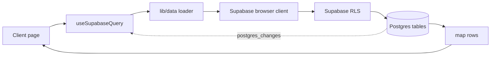
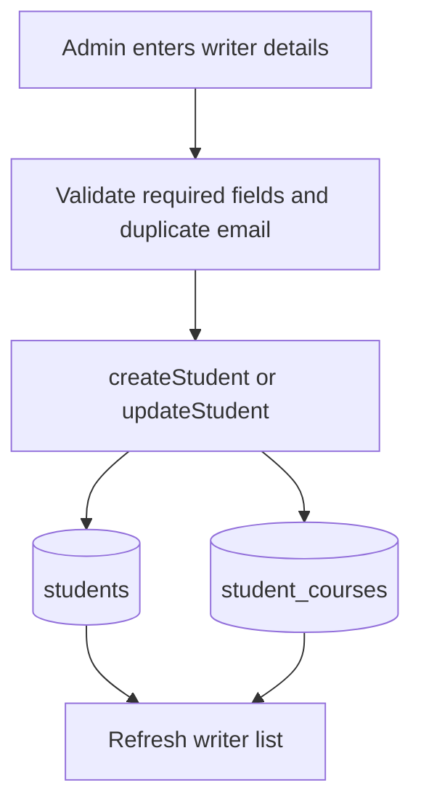
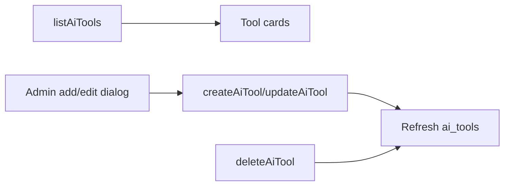
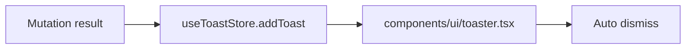
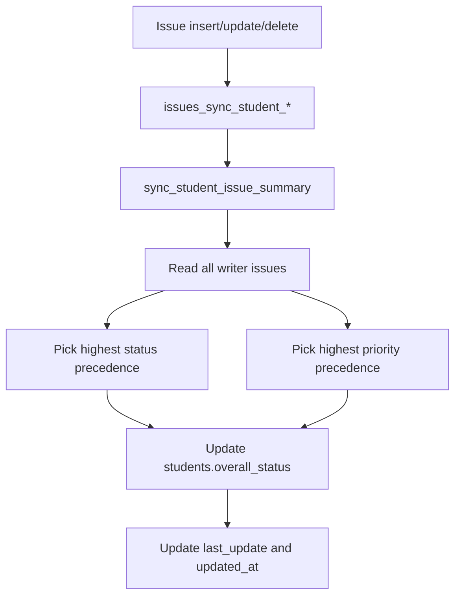
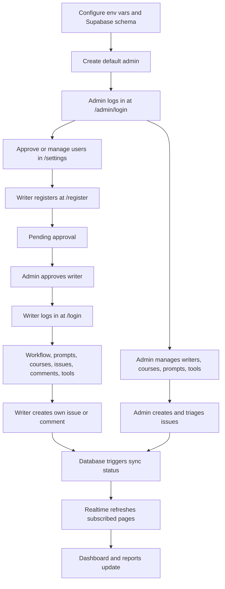

# System Flow

This document describes the current TDS Management system flow as implemented in the app. The current app is auth-enabled: Supabase Auth identifies users, `user_roles` stores role and approval state, `proxy.ts` protects routes, and Supabase RLS enforces data access.

## System Overview

TDS Management is a Next.js 16 App Router dashboard for academic operations. Admin users manage writers, courses, issues, comments, prompts, reports, AI tools, and account approvals. Writer expert users register into a pending state, wait for admin approval, then access a limited workspace for workflows, prompts, courses, issues, comments, and AI tools.

The main runtime layers are:

| Layer | Main Files | Role |
| --- | --- | --- |
| Route protection | `proxy.ts` | Redirects unauthenticated users, pending users, rejected users, and role-mismatched users. |
| Auth profile | `lib/auth/server.ts`, `lib/auth/roles.ts`, `/api/auth/me` | Resolves the current Supabase user plus `user_roles` row. |
| Client data | `lib/data/*`, `lib/supabase.ts` | Reads and mutates Supabase tables through the browser Supabase client. |
| Server admin APIs | `app/api/users/*`, `app/api/report/[studentId]/pdf/route.ts` | Uses service-role access only where server-side privileged work is required. |
| UI shell | `components/layout/dashboard-layout.tsx` | Shows role-aware navigation, profile state, theme, PWA, and sign out. |
| Database | `supabase/schema.sql` | Tables, triggers, approval-aware RLS, and realtime publication. |

```mermaid
flowchart TD
  Request[Browser request] --> Proxy[proxy.ts]
  Proxy --> Auth{Supabase session?}
  Auth -- no --> Login[/login or /admin/login]
  Auth -- yes --> RoleRow[user_roles lookup]
  RoleRow --> Status{Approved?}
  Status -- pending --> Pending[/pending-approval]
  Status -- rejected/disabled --> Denied[/access-denied]
  Status -- approved --> Role{Role}
  Role -- admin --> AdminShell[Admin dashboard shell]
  Role -- student --> StudentShell[Writer expert shell]
  AdminShell --> Pages[App pages]
  StudentShell --> AllowedPages[Student-allowed pages]
  Pages --> Data[lib/data helpers]
  AllowedPages --> Data
  Data --> Supabase[(Supabase + RLS)]
```

## Authentication And Approval Flow

### Login Pages

| Route | Purpose | Expected Role |
| --- | --- | --- |
| `/login` | Writer expert login | `student` |
| `/admin/login` | Admin login | `admin` |
| `/register` | Writer expert registration | Creates pending `student` account |
| `/pending-approval` | Waiting room for pending accounts | Any pending user |
| `/access-denied` | Rejected, disabled, or blocked account state | Any rejected/disabled user |

`components/auth/login-card.tsx` is used by both login pages. On submit it:

1. Creates a browser Supabase client.
2. Signs out any existing browser session so account switching starts cleanly.
3. Calls `supabase.auth.signInWithPassword()`.
4. Calls `/api/auth/me` to read the current profile.
5. Rejects the login if the resolved role does not match the page's expected role.
6. Redirects approved admins to `/`, approved writer experts to `/workflow`, pending accounts to `/pending-approval`, and rejected or disabled accounts to `/access-denied`.

```mermaid
flowchart TD
  Form[Login form submit] --> ClearSession[Sign out existing session]
  ClearSession --> PasswordLogin[Supabase password login]
  PasswordLogin --> Profile[/api/auth/me]
  Profile --> RoleMatch{Role matches login page?}
  RoleMatch -- no --> SignOut[Sign out and show role error]
  RoleMatch -- yes --> Status{Profile status}
  Status -- approved admin --> Dashboard[/]
  Status -- approved student --> Workflow[/workflow]
  Status -- pending --> Pending[/pending-approval]
  Status -- rejected/disabled --> Denied[/access-denied]
```

### Registration

`app/api/auth/register/route.ts` creates writer expert accounts with service-role privileges.

Registration steps:

1. Validate name, email, and password.
2. Create a Supabase Auth user with confirmed email and metadata `{ role: "student", status: "pending", name }`.
3. Insert a matching `students` row linked through `students.user_id`.
4. Upsert a `user_roles` row with role `student`, status `pending`, and the new `student_id`.
5. Roll back the student and auth user on failure where possible.

```mermaid
flowchart TD
  RegisterForm[/register form] --> RegisterApi[/api/auth/register]
  RegisterApi --> AuthUser[Create auth user]
  AuthUser --> StudentRow[Insert students row]
  StudentRow --> RoleRow[Upsert user_roles pending student]
  RoleRow --> Pending[/pending-approval]
```

### Current Profile

The app uses `/api/auth/me` as the client-safe source of truth for the current user.

`lib/auth/server.ts#getCurrentUserProfile()`:

1. Creates a server Supabase client from request cookies.
2. Calls `supabase.auth.getUser()`.
3. Reads `user_roles` for the auth user.
4. Normalizes unknown or missing role/status to `student` and `pending`.
5. Returns `{ userId, email, role, status, studentId }`.

Client helpers:

| Helper | Role |
| --- | --- |
| `getCurrentProfileFromApi()` | Fetches `/api/auth/me`, returns profile or null. |
| `useCurrentUserRole()` | React hook exposing `profile`, `role`, `status`, `isAdmin`, and `isStudent`. |
| `assertAdmin()` | Throws unless the current profile is an approved admin. |

## Route Protection

`proxy.ts` runs before page requests. It is based on the Next.js 16 Proxy convention.

Public page routes:

| Route | Behavior |
| --- | --- |
| `/login` | Always allowed so users can switch accounts. |
| `/admin/login` | Always allowed so users can switch accounts. |
| `/register` | Redirects signed-in users to their home state. |
| `/pending-approval` | Allowed only when it matches the signed-in user's pending state. |
| `/access-denied` | Allowed only when it matches rejected/disabled state. |

Protected routing rules:

| User State | Destination |
| --- | --- |
| No session, admin-only path | `/admin/login?next=...` |
| No session, non-admin path | `/login?next=...` |
| Pending | `/pending-approval` |
| Rejected or disabled | `/access-denied` |
| Approved admin | Any app route |
| Approved student on admin-only route | `/workflow` |
| Approved student on allowed route | Requested route |

Admin-only path prefixes:

```text
/
/students
/reports
/settings
```

Student-allowed path prefixes:

```text
/workflow
/prompts
/tools
/courses
/issues
/comments
/api/auth
```

## Authorization Model

The app has two runtime roles and four approval states.

| Role | Meaning |
| --- | --- |
| `admin` | Full operational access after approval. |
| `student` | Writer expert access after approval. |

| Status | Meaning |
| --- | --- |
| `pending` | Account exists but cannot access the app yet. |
| `approved` | Account can use routes and data allowed by role. |
| `rejected` | Account is blocked and sent to `/access-denied`. |
| `disabled` | Account is blocked and sent to `/access-denied`. |

Authorization happens at three levels:

| Level | Mechanism |
| --- | --- |
| Navigation | `DashboardLayout` filters sidebar links by profile role. |
| Client mutations | `assertAdmin()` blocks admin-only mutations; issue/comment creation allows approved students for their own writer record. |
| Database | Supabase RLS functions and policies enforce approved admin or approved student access. |

## Database Access And RLS

Browser-side data modules use `requireSupabase()` from `lib/data/client.ts`. If Supabase public env vars are missing, it throws a configuration error and pages render an error state.

Server-only service-role access is limited to:

| API Route | Why Service Role Is Needed |
| --- | --- |
| `/api/auth/register` | Create auth user and initial role/student rows. |
| `/api/users` | List and invite/manage Supabase Auth users. |
| `/api/users/[userId]` | Patch/delete users and role rows. |
| `/api/report/[studentId]/pdf` | Generate PDF after requiring an approved user. |

`supabase/schema.sql` defines approval-aware helper functions:

| Function | Purpose |
| --- | --- |
| `current_user_role()` | Reads `user_roles.role` for `auth.uid()`. |
| `current_user_status()` | Reads `user_roles.status` for `auth.uid()`. |
| `current_student_id()` | Reads linked writer record from `user_roles.student_id`. |
| `is_approved_admin()` | True for approved admins. |
| `is_approved_student()` | True for approved writer experts. |

RLS policy summary:

| Table Group | Admin Access | Student Access |
| --- | --- | --- |
| App tables | Approved admins can read, insert, update, and delete. | Approved students get scoped reads and limited inserts. |
| `user_roles` | Approved admins can manage role rows. | Users can read their own role row. |
| `courses` | All admin operations. | Read only courses assigned to the current writer. |
| `students` | All admin operations. | Read only own writer record. |
| `student_courses` | All admin operations. | Read own enrollments. |
| `issues` | All admin operations. | Read and create own issues. |
| `comments` | All admin operations. | Read and create own comments. |
| `prompts` | All admin operations. | Read prompts. |
| `ai_tools` | All admin operations. | Read AI tools. |

## Runtime Data Flow

Most client pages follow the same pattern:

1. A page calls `useSupabaseQuery(load, initialData, realtimeTables, reloadKey?)`.
2. The hook runs a loader from `lib/data/*`.
3. The loader uses `requireSupabase()` and the browser user's session.
4. Supabase RLS filters or blocks data based on the user.
5. Rows are mapped into UI-friendly camelCase objects by `lib/data/mappers.ts`.
6. The hook subscribes to configured realtime tables.
7. Realtime changes debounce `refresh()` by 500ms.
8. Mutations refresh the local view and show toast messages where implemented.



## Core Data Model

| Entity | Table | Purpose |
| --- | --- | --- |
| Writer | `students` | Writer expert profile, trainer, notes, progress, derived status and priority. |
| Course | `courses` | Course code and title. |
| Enrollment | `student_courses` | Many-to-many writer to course assignment. |
| Issue | `issues` | Writer support ticket with category, status, and priority. |
| Comment | `comments` | Thread message tied to a writer and optionally an issue. |
| Prompt | `prompts` | Reusable prompt template with tags and optional course link. |
| AI Tool | `ai_tools` | Approved AI resource directory entry. |
| User Role | `user_roles` | Auth role, approval state, linked writer, and approval metadata. |

## Feature Flows

### Dashboard

Route: `/`

Role: approved admin only.

The dashboard loads `getDashboardData()` from `lib/data/dashboard.ts`, which fetches students, courses, issues, and AI tools.

| Block | Source |
| --- | --- |
| Total writers | `students.length` |
| Active courses | `courses.length` |
| Open issues | Issues not marked `Resolved` |
| Resolved issues | Issues marked `Resolved` |
| Pending reviews | Issues marked `Pending` |
| Charts | Issue category and status aggregates |
| Recent writers | First entries from the writer list |

```mermaid
flowchart TD
  Dashboard[/] --> GetData[getDashboardData]
  GetData --> Students[listStudents]
  GetData --> Courses[listCourses]
  GetData --> Issues[listIssues]
  GetData --> Tools[listAiTools]
  Students --> Metrics[Metrics and tables]
  Courses --> Metrics
  Issues --> Metrics
  Tools --> Metrics
```

### Writers

Route: `/students`

Role: approved admin only.

Admins can view, search, create, edit, and delete writer records, assign courses, set trainer, status, progress, and notes.

Create/update flow:



Student creation maps UI writer status into `overall_status`:

| UI Status | Stored `overall_status` |
| --- | --- |
| Active | `In Progress` |
| Inactive | `Pending` |

Issue triggers later recalculate derived writer status and priority.

### Courses

Route: `/courses`

Roles: approved admin and approved student.

Admins can create, edit, and delete courses. Students can read only assigned courses through RLS.

```mermaid
flowchart TD
  CoursePage[/courses] --> List[listCoursesWithEnrollmentPage]
  List --> RLS[Supabase RLS]
  RLS --> Courses[(courses)]
  AdminForm[Admin form] --> CreateOrUpdate[createCourse/updateCourse/deleteCourse]
  CreateOrUpdate --> Refresh[Refresh courses]
```

Courses connect to writers through `student_courses` and to prompts through `prompts.related_course_id`.

### Issues

Route: `/issues`

Roles: approved admin and approved student.

Admins can view and manage all issues. Approved students can view their own issues and create issues for their own linked writer record.

Issue creation authorization:

| Actor | Allowed? |
| --- | --- |
| Approved admin | Can create for any writer. |
| Approved student | Can create only when `profile.studentId === input.studentId`. |
| Pending/rejected/disabled/no session | Blocked. |

```mermaid
flowchart TD
  NewIssue[New issue dialog] --> Profile[/api/auth/me]
  Profile --> Allowed{Admin or own approved writer?}
  Allowed -- no --> Error[Show authorization error]
  Allowed -- yes --> Insert[Insert issues row]
  Insert --> Trigger[issues_sync_student_insert]
  Trigger --> Summary[Update writer derived status/priority]
  Summary --> Realtime[Realtime refresh]
```

Issue status updates are admin-only and use `updateIssueStatus()`.

### Comments And Tickets

Route: `/comments`

Roles: approved admin and approved student.

Admins can reply as Admin or Student, update issue status, edit comments, delete comments, and create new issues. Approved students can comment on their own tickets only, and their inserted comments must use role `Student`.

```mermaid
flowchart TD
  SelectIssue[Select issue] --> ListComments[listCommentsPage]
  WriteReply[Write reply] --> Profile[/api/auth/me]
  Profile --> Allowed{Admin or own approved writer?}
  Allowed -- no --> Error[Show authorization error]
  Allowed -- yes --> Insert[Insert comments row]
  Insert --> RoleCheck{Comment role Student?}
  RoleCheck -- yes --> PendingTrigger[comments_student_pending trigger]
  PendingTrigger --> MarkPending[Set issue to Pending]
  MarkPending --> SyncStudent[Sync writer last_update/status]
  RoleCheck -- no --> Refresh[Refresh thread]
  SyncStudent --> Refresh
```

Database rule: when a comment is inserted with role `Student` and an `issue_id`, the related issue is marked `Pending`.

### Prompts

Route: `/prompts`

Roles: approved admin and approved student.

Admins can create, edit, and delete prompts. Approved students can read prompts. Prompt tags are entered as comma-separated text and stored as `text[]`.

```mermaid
flowchart TD
  PromptPage[/prompts] --> List[listPromptsPage]
  List --> Search[Search/filter/preview]
  AdminForm[Admin prompt form] --> Save{Editing?}
  Save -- yes --> Update[updatePrompt]
  Save -- no --> Create[createPrompt]
  Update --> Refresh[Refresh prompts]
  Create --> Refresh
  Delete[deletePrompt] --> Refresh
```

### Reports

Routes:

- `/reports`
- `/reports/[studentId]`

Role: approved admin only.

The reports index lists writers with status and issue counts. The detail page loads writer, issue, comment, and course context, then renders profile, issue tables, comment history, and activity-style progress information.

```mermaid
flowchart TD
  Reports[/reports] --> Select[Open writer report]
  Select --> Detail[/reports/:studentId]
  Detail --> Load[listStudents + listIssues + listComments]
  Load --> Aggregates[Report aggregates]
  Aggregates --> PdfLink[/api/report/:studentId/pdf]
  PdfLink --> RequireUser[requireApprovedUser]
  RequireUser --> ServiceClient[createServiceRoleClient]
  ServiceClient --> RenderPdf[@react-pdf/renderer]
  RenderPdf --> Download[PDF attachment]
```

The PDF route requires an approved user before using service-role data loading.

### AI Tools

Route: `/tools`

Roles: approved admin and approved student.

Admins can create, edit, and delete AI tool records. Approved students can read the tool directory.



### Workflow

Routes:

- `/workflow`
- `/workflow/[slug]`

Roles: approved admin and approved student.

Workflow pages are server components using static data from `app/workflow/workflow-data.ts`. They do not query Supabase or subscribe to realtime changes.

```mermaid
flowchart TD
  WorkflowIndex[/workflow] --> Cards[workflowCards]
  Cards --> Detail[/workflow/:slug]
  Detail --> Data[workflow-data.ts]
  Data --> Steps[workflowSteps]
  Data --> Prompts[Prompt blocks]
  Prompts --> Copy[CopyWorkflowButton]
```

### Settings And User Management

Route: `/settings`

Role: approved admin only.

The settings page checks Supabase connectivity by selecting one course ID. It also lists user accounts and lets admins update role/status or remove users.

User management API routes:

| Route | Methods | Behavior |
| --- | --- | --- |
| `/api/users` | `GET` | Lists Supabase Auth users joined with `user_roles`. |
| `/api/users` | `POST` | Invites a user and creates a role row. |
| `/api/users/[userId]` | `PATCH` | Updates role/status and auth metadata. |
| `/api/users/[userId]` | `DELETE` | Deletes role row and auth user. |

`requireAdminRequest()` protects these routes and returns the current admin profile plus a service-role Supabase client.

Self-protection rule: an admin cannot remove their own admin access or delete their own account.

```mermaid
flowchart TD
  Settings[/settings] --> LoadUsers[/api/users GET]
  LoadUsers --> RequireAdmin[requireAdminRequest]
  RequireAdmin --> ListAuth[auth.admin.listUsers]
  RequireAdmin --> ListRoles[user_roles select]
  AdminAction[Approve/reject/disable/change role/delete] --> UserApi[/api/users/:userId]
  UserApi --> ServiceRole[Service-role Supabase client]
  ServiceRole --> UpdateRole[user_roles]
  ServiceRole --> UpdateMetadata[Auth user metadata]
```

## Layout, Navigation, Theme, PWA, And Toasts

`app/layout.tsx` wraps the app with metadata, theme bootstrap, PWA registration, `DashboardLayout`, and the toaster.

`DashboardLayout`:

- Does not render the dashboard shell on public auth pages.
- Fetches `/api/auth/me` for profile display and role-aware navigation.
- Shows admin links only to admins.
- Shows writer-safe links to both admins and students.
- Signs users out through the browser Supabase client and redirects by role.
- Provides theme toggle and PWA install UI.

Toast flow:



Global search state lives in `store/useSearchStore.ts` where used by page-level filtering.

## Data Access Modules

| Module | Reads | Mutations |
| --- | --- | --- |
| `students.ts` | `listStudents`, `listStudentsPage`, `listStudentById` | `createStudent`, `updateStudent`, `deleteStudent` |
| `courses.ts` | `listCourses`, `listCoursesWithEnrollmentPage` | `createCourse`, `updateCourse`, `deleteCourse` |
| `issues.ts` | `listIssues`, `listIssuesByStudentId`, `listIssuesPage` | `createIssue`, `updateIssueStatus` |
| `comments.ts` | `listCommentsByStudentId`, `listCommentsPage` | `createComment`, `updateComment`, `deleteComment` |
| `prompts.ts` | `listPromptsPage`, `listPromptById` | `createPrompt`, `updatePrompt`, `deletePrompt` |
| `ai-tools.ts` | `listAiTools` | `createAiTool`, `updateAiTool`, `deleteAiTool` |
| `dashboard.ts` | `getDashboardData`, `getReportsIndexData` | None |
| `workflow-data.ts` | Static workflow card, step, and prompt data | None |

Shared helpers:

| Helper | Role |
| --- | --- |
| `requireSupabase()` | Ensures public Supabase config exists and returns the browser client. |
| `getErrorMessage()` | Converts unknown errors to UI-safe strings. |
| `readJsonResponse()` | Safely reads JSON API responses. |
| `normalizeOptionalText()` | Converts blank optional strings to `null`. |
| `mapCourse`, `mapStudent`, `mapIssue`, `mapComment`, `mapPrompt`, `mapAiTool` | Convert Supabase rows to app types. |
| `getPaginationRange`, `toPaginatedResult` | Normalize paginated table reads. |
| `useSupabaseQuery()` | Loads data, exposes loading/error/refresh, and subscribes to realtime. |

## Realtime Subscriptions

Pages subscribe only to tables that affect visible data.

| UI Surface | Realtime Tables |
| --- | --- |
| Dashboard | `students`, `student_courses`, `courses`, `issues`, `comments`, `ai_tools` |
| Writers | `students`, `student_courses`, `courses`, `issues` |
| Courses | `courses`, `student_courses` |
| Issues | `issues`, `students`, `comments` |
| Comments and Tickets | `students`, `issues`, `comments` |
| Prompts | `courses`, `prompts` |
| Reports index | `students`, `student_courses`, `courses`, `issues` |
| Student report | `students`, `student_courses`, `courses`, `issues`, `comments` |
| AI Tools | `ai_tools` |
| Workflow | None |
| Settings user table | Manual API reload after mutations |

Realtime publication includes:

```text
courses
students
student_courses
issues
comments
prompts
ai_tools
user_roles
```

## Database Automation

### Updated Timestamps

`set_updated_at()` runs before updates on:

- `courses`
- `students`
- `issues`
- `comments`
- `prompts`
- `ai_tools`
- `user_roles`

### Writer Status Sync

`sync_student_issue_summary(target_student_id)` derives writer status and priority from all issues for a writer.

Status precedence:

| Precedence | Status |
| --- | --- |
| Highest | `Escalated` |
|  | `Pending` |
|  | `In Progress` |
| Lowest | `Resolved` |

Priority precedence:

| Precedence | Priority |
| --- | --- |
| Highest | `Critical` |
|  | `High` |
|  | `Medium` |
| Lowest | `Low` |



If a writer has no remaining issues, the function falls back to `Resolved` status and `Low` priority.

### Student Comment Pending Rule

`mark_issue_pending_after_student_comment()` runs after comment inserts.

If the new comment has role `Student` and an `issue_id`, it:

1. Updates the related issue status to `Pending`.
2. Updates the writer's `last_update` and `updated_at`.
3. Lets the issue update trigger refresh the writer summary.

## End-To-End Operational Flow



## Environment And Setup Flow

Required `.env.local` values:

```text
NEXT_PUBLIC_SUPABASE_URL=...
NEXT_PUBLIC_SUPABASE_ANON_KEY=...
SUPABASE_SERVICE_ROLE_KEY=...
```

Setup steps:

1. Install dependencies.
2. Apply `supabase/schema.sql`.
3. Apply `supabase/seed.sql` for baseline AI tools.
4. For existing databases, apply `supabase/auth-approval-migration.sql` before relying on approval-aware auth.
5. Run `npm run seed:admin` to create or repair the default admin.
6. Start the app with `npm run dev`.

Default admin, when seeded:

```text
admin@tds.com / khan123office
```

On Windows PowerShell, use `npm.cmd` if `.ps1` execution is blocked:

```text
npm.cmd run lint
npm.cmd run build
```

## Current Implementation Notes

- The app is no longer open-access; Supabase Auth, `user_roles`, Proxy routing, and RLS are part of the normal flow.
- Login pages remain accessible even when a session exists so users can switch between admin and writer accounts.
- Writer registration always starts as `student` plus `pending`.
- Admin approval is stored in `user_roles.status`; auth metadata is updated for managed users as a compatibility mirror.
- Client data reads use the user's browser Supabase session, so RLS is the final access gate.
- Admin-only mutations call `assertAdmin()`.
- Student issue and comment creation checks both profile status and `studentId` ownership before inserting.
- Service-role keys are used only in server route handlers.
- Workflow pages are static server components and do not depend on Supabase.
- Analytics is not part of the active navigation until real aggregates are implemented.
- Seed data is intentionally limited to approved baseline AI tool records.
