# System Flow

> Legacy note: this document still describes the pre-auth open-access flow. The current app requires Supabase Auth, approval status checks, and role-based route access. Use `README.md`, `supabase/schema.sql`, and the current `lib/auth/*` implementation as the source of truth until this document is rewritten.

This document explains the current TDS Management academic services dashboard flow, including how pages, Supabase data modules, realtime refreshes, database triggers, and shared UI state connect.

## System Overview

TDS Management is a Next.js App Router dashboard for tracking students, courses, issues, comments, prompts, reports, AI tool metrics, analytics shells, and platform settings in open-access mode.

The active data layer is Supabase, accessed from client components through the modules in `lib/data/`. Pages use `useSupabaseQuery` from `lib/data/hooks.tsx` to load records, show loading and error states, and subscribe to Supabase Realtime table changes. Login and route protection are intentionally removed: every app route renders directly, role helpers return open admin access, and database policies allow anon/authenticated access to app tables. Zustand is still present, but it is no longer the primary app data store. The active Zustand usage is `store/useToastStore.ts` for notifications and `store/useSearchStore.ts` for the shared search input.

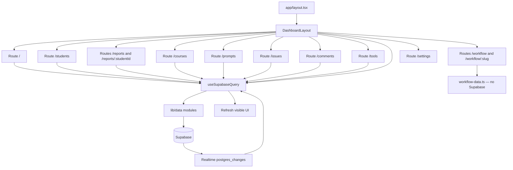

## Runtime Data Flow

Most pages follow the same pattern:

1. A client page calls `useSupabaseQuery(load, initialData, realtimeTables)`.
2. The hook calls a loader from `lib/data/`.
3. The loader uses `requireSupabase()` from `lib/data/client.ts`.
4. Supabase rows are converted to UI-friendly camelCase objects by `lib/data/mappers.ts`.
5. The hook subscribes to each listed realtime table and debounces `refresh()` by 500ms when matching table changes arrive in quick succession.
6. Mutations call `create*`, `update*`, or `delete*` helpers, then call `refresh()` and show a toast when appropriate.

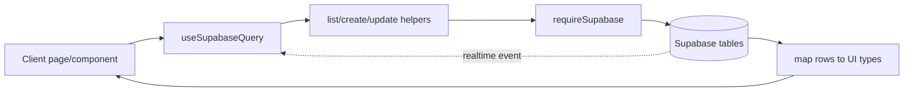

If Supabase is not configured with `NEXT_PUBLIC_SUPABASE_URL` and `NEXT_PUBLIC_SUPABASE_ANON_KEY`, `requireSupabase()` throws a configuration error and pages render `ErrorState`.

## Core Data Model

| Entity | Purpose | Connected To |
| --- | --- | --- |
| Student | Person being tracked for academic progress and support needs. | Courses, Issues, Comments, Reports |
| Course | Academic course or curriculum item. | Students, Prompts |
| Issue | Problem, ticket, or support item tied to a student. | Student, Comments, Dashboard, Reports |
| Comment | Thread message on an issue or student record. | Student, Issue |
| Prompt | Saved prompt/template for academic workflows. | Course optionally |
| AI Tool | Optional directory entry for real AI resources. | AI Tools Directory |
| User Role | Legacy compatibility role table. | Optional Supabase Auth user |

## Open Access and Authorization

There is no login page, no proxy route guard, and no Supabase Auth session requirement for the dashboard. The app opens directly at `/`.

Runtime route flow:

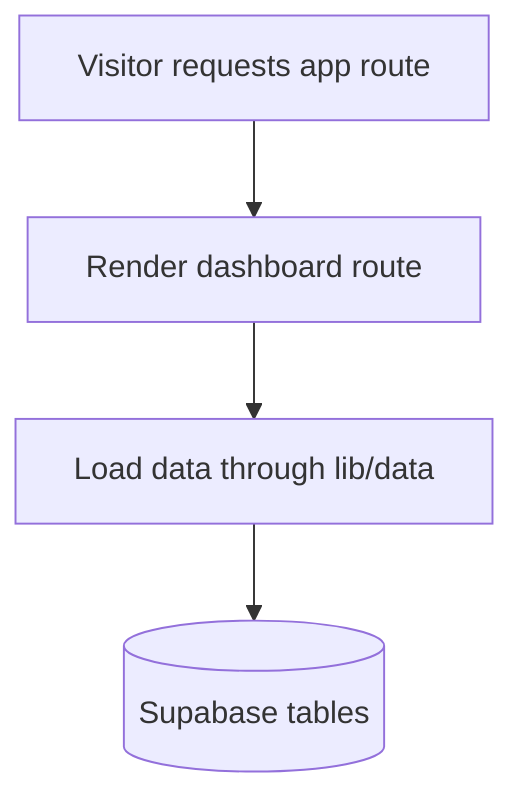

Compatibility authorization helpers keep the UI in admin-capable mode:

| Role | Access |
| --- | --- |
| `admin` | Open workspace mode: read data, use mutation buttons, manage users, and perform writes. |
| `viewer` | Legacy role value kept for compatibility. |

The UI reads role state through `lib/auth/roles.ts` and `lib/auth/use-current-user-role.ts`; both resolve to admin/open access. Data mutation helpers still call `assertAdmin()` for compatibility, but it allows mutations. Supabase RLS policies are open for app tables in this no-login workspace.

## Feature Map

### 1. Dashboard

Route: `/`

The dashboard loads `getDashboardData()` from `lib/data/dashboard.ts`, which fetches students, courses, and issues in parallel.

| Dashboard Block | Source |
| --- | --- |
| Total students | `students.length` |
| Active courses | `courses.length` |
| Open issues | Issues where status is not `Resolved` |
| Resolved issues | Issues where status is `Resolved` |
| Pending reviews | Issues where status is `Pending` |
| Issue category chart | Issues grouped by category |
| Resolution progress chart | Issues grouped by status |
| Recent students table | First five students from the loaded student list |

Dashboard charts are dynamically imported with SSR disabled because they depend on Recharts browser rendering.

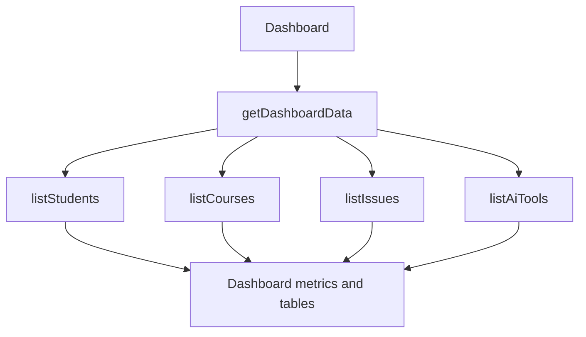

### 2. Students

Route: `/students`

The students page lets an admin:

- View students.
- Search students by name or assigned course code.
- Add a new student.
- Edit an existing student.
- Delete a student after confirmation.
- Page through student records with limit/offset loading.
- Assign courses by course ID.
- Store email, assigned trainer, initial status, and notes.
- See derived issue categories, priority, status, and trainer.

Create flow:

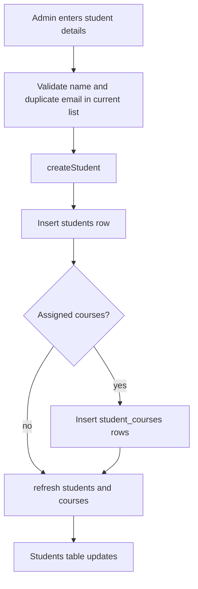

Student creation maps the UI's initial status to issue-status values:

| UI status | Stored `overall_status` |
| --- | --- |
| Active | `In Progress` |
| Inactive | `Pending` |

After issues are created or changed, database triggers keep the student's derived status, priority, and last update in sync.

### 3. Courses

Route: `/courses`

The courses page lets an admin:

- View registered courses.
- Add a course code and title.
- Edit an existing course.
- Delete a course after confirmation.
- Page through course records with limit/offset loading.
- Prevent duplicate course codes.
- See enrollment count from `student_courses`.

Create flow:

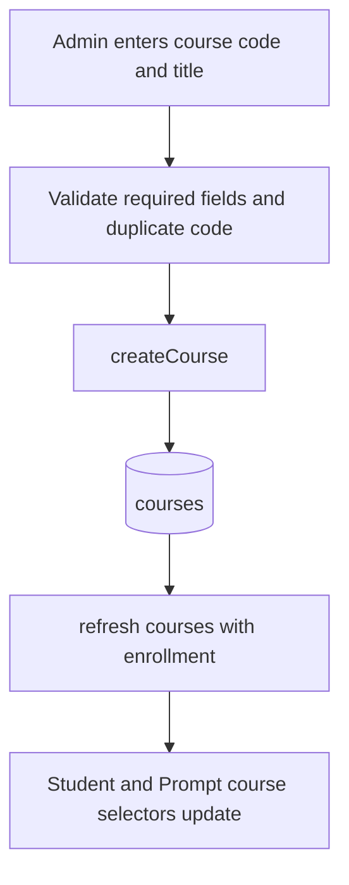

Courses connect to students through `student_courses` and to prompts through `prompts.related_course_id`.

### 4. Issues

Route: `/issues`

The issues page displays all tracked student issues and includes the shared `NewIssueDialog`.
The issues table is loaded with limit/offset pagination.

An issue has:

- Student
- Category
- Description
- Status
- Priority
- Created date
- Updated date

Create flow:

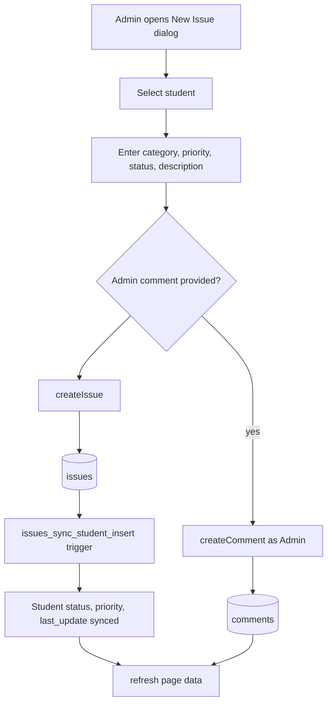

Issue status changes are handled by `updateIssueStatus()`. The database trigger recalculates the related student's summary after issue inserts, updates, and deletes.

### 5. Comments / Tickets

Route: `/comments`

The comments page is the ticket-thread workspace. It lets an admin:

- Select an issue from the active issue list.
- View the initial issue description and all related comments.
- Reply as `Admin` or `Student`.
- Optionally update issue status when replying as Admin.
- Edit comments.
- Delete comments.
- Create a new issue through the shared `NewIssueDialog`.
- Page through comments for the selected issue with limit/offset loading.

Reply flow:

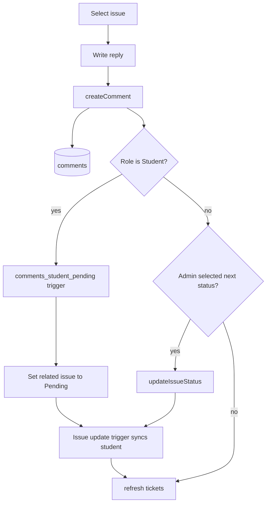

The key rule is database-enforced: a student-role comment on an issue marks that issue `Pending` and updates the related student timestamp.

### 6. Prompts

Route: `/prompts`

The prompts page manages reusable prompt templates. It supports:

- Create prompt.
- Edit prompt.
- Delete prompt.
- Copy prompt content to the clipboard.
- Search by title, content, or tags.
- Filter by category.
- Page through prompts with limit/offset loading.
- Link a prompt to a course or mark it as usable for any course.
- Preview the selected prompt.

Prompt flow:

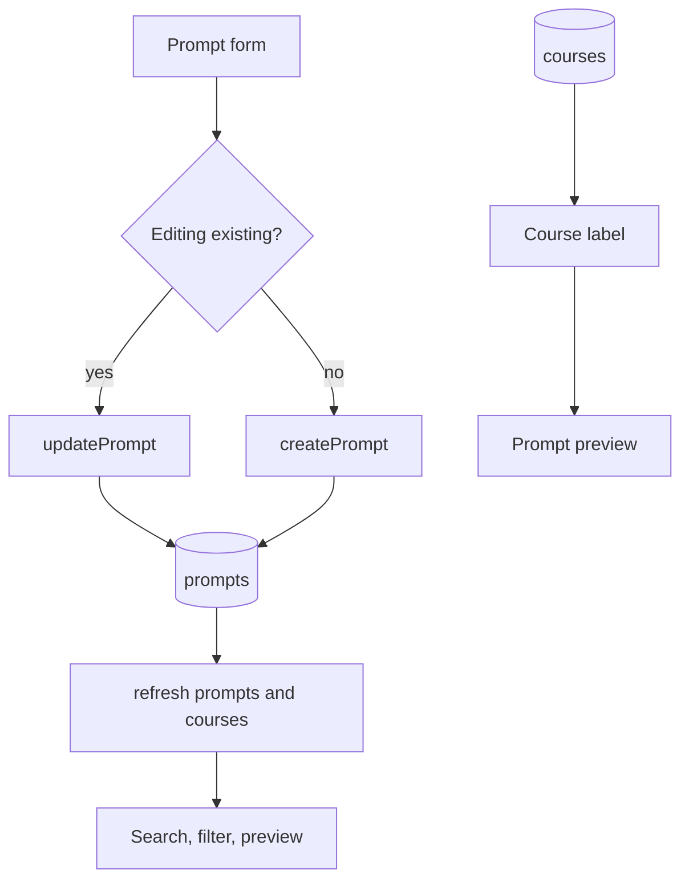

Tags are entered as comma-separated text in the UI and stored as a `text[]` array in Supabase.

### 7. Reports

Routes:

- `/reports`
- `/reports/[studentId]`

The reports index loads students and issues, then lists each student with trainer, open issue count, status, and a link to the detailed report.

The individual student report loads students, issues, and comments, then aggregates:

- Student profile.
- Assigned courses.
- Overall issue counts.
- Open and resolved issue counts.
- Issue category summary.
- Full issue table.
- Comment history.
- Timeline-style activity composed from issues and comments.

Report flow:

```mermaid
flowchart TD
  ReportsIndex[Reports index] --> SelectStudent[View Report link]
  SelectStudent --> StudentReport[Student report page]
  StudentReport --> LoadData[listStudents + listIssues + listComments]
  LoadData --> Aggregates[Issue and comment aggregates]
  Aggregates --> Tabs[Overview, Issues, Comments, Progress]
  Tabs --> ExportButton[Open /api/report/:studentId/pdf]
  ExportButton --> PdfRoute[Server PDF route]
  PdfRoute --> ReactPdf[@react-pdf/renderer]
  ReactPdf --> Download[application/pdf attachment]
```

The dynamic report route receives `params` as a Promise and reads it with React `use(params)`, matching the current Next.js App Router route-props model.

PDF export is handled by `app/api/report/[studentId]/pdf/route.ts`. The route loads students, issues, and comments server-side, renders a clean PDF with `@react-pdf/renderer`, and returns it as an attachment.

### 8. AI Tools Directory

Route: `/tools`

This page loads real AI tool records from Supabase and shows:

- Tool directory cards.
- Tool name and description.
- Add tool dialog.
- Edit action per card.
- Delete confirmation per card.

Flow:

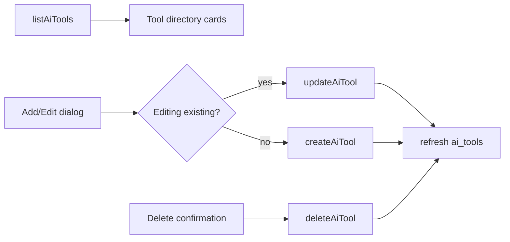

Successful create, update, and delete actions refresh the directory and show toast notifications.

### 9. Workflow

Routes:
- `/workflow`
- `/workflow/[slug]`

The workflow pages are **server components** that consume static data from `app/workflow/workflow-data.ts` — no Supabase queries or realtime subscriptions are involved.

The index page (`/workflow`) renders a 2-column card grid:

- Each card shows an icon, category badge, title, description, and a CTA link.
- Four workflow types exist: Unknown Assignment, Tools Installation, Standard Academic Assignment, Master Assignment Prompt.

The detail page (`/workflow/[slug]`) uses `generateStaticParams` to pre-render all four workflow guides at build time. Each page renders:

- Step-by-step instruction cards from `workflowSteps`.
- Prompt block cards with copy-to-clipboard functionality via `CopyWorkflowButton`.
- A template placeholder guide table with token descriptions.

Flow:

```mermaid
flowchart TD
  WorkflowIndex[/workflow] --> Cards[Card grid from workflowCards]
  Cards --> Detail[/workflow/:slug]
  Detail --> WorkflowData[workflow-data.ts]
  WorkflowData --> Steps[workflowSteps]
  WorkflowData --> Prompts[Prompt blocks]
  WorkflowData --> Placeholders[Placeholder guide table]
  Steps --> CopyButton[CopyWorkflowButton]
  Prompts --> CopyButton
  CopyButton --> Clipboard[navigator.clipboard]
```

The workflow module exports four main data structures: `workflowCards` (index cards), `workflowSteps` (step arrays per slug), `masterPrompt` / `placeholderGuide` (utility exports for the master prompt workflow), and individual prompt constants for each workflow type.

### 10. Analytics

Route: `/analytics`

The analytics route remains hidden from the sidebar until it loads real Supabase aggregates.

### 11. Settings

Route: `/settings`

The settings page currently displays read-only platform configuration sections:

- Organization settings.
- Supabase integration status.
- Optional user management tools.

The Supabase integration status is checked on mount by calling `requireSupabase()` and querying `courses` with `.select("id").limit(1)`. The UI shows a loading state while the check is running, a green connected state on success, or a red disconnected state with the returned error message on failure.

User management runs through API routes that use `SUPABASE_SERVICE_ROLE_KEY` server-side. It is available as an operational tool, but the dashboard itself does not require a user login.

### 12. Layout, Navigation, Theme, Toasts, and PWA

Shared layout:

- `app/layout.tsx`
- `components/layout/dashboard-layout.tsx`

The root layout provides metadata, viewport configuration, theme bootstrapping, service worker registration, the dashboard shell, and the toaster.

The dashboard layout provides:

- Desktop and mobile sidebar navigation.
- Active-route highlighting.
- Global search input backed by `store/useSearchStore.ts`.
- Notification dot based on open issue count.
- Open issue badge in the sidebar.
- Theme toggle.
- PWA install button.
- Open workspace status.

Open issue notification flow:

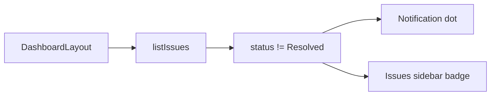

Toast flow:

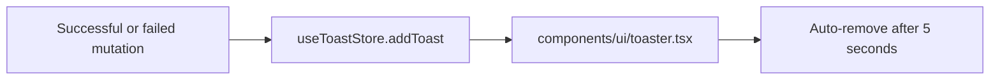

PWA flow:

```mermaid
flowchart LR
  Manifest[app/manifest.ts] --> BrowserManifest[/manifest.webmanifest]
  PwaRegister[PwaRegister] --> ProductionCheck{Production build?}
  ProductionCheck -- yes --> ServiceWorker[Register /sw.js]
  DashboardLayout --> InstallButton[PWA install button]
```

## Data Access Modules

The active data access functions live under `lib/data/`.

| Module | Reads | Mutations |
| --- | --- | --- |
| `students.ts` | `listStudents`, `listStudentsPage` | `createStudent`, `updateStudent`, `deleteStudent` |
| `courses.ts` | `listCourses`, `listCoursesWithEnrollment`, `listCoursesWithEnrollmentPage` | `createCourse`, `updateCourse`, `deleteCourse` |
| `issues.ts` | `listIssues`, `listIssuesPage` | `createIssue`, `updateIssueStatus` |
| `comments.ts` | `listComments`, `listCommentsPage` | `createComment`, `updateComment`, `deleteComment` |
| `prompts.ts` | `listPrompts`, `listPromptsPage` | `createPrompt`, `updatePrompt`, `deletePrompt` |
| `ai-tools.ts` | `listAiTools`, `listAiToolsPage` | `createAiTool`, `updateAiTool`, `deleteAiTool` |
| `dashboard.ts` | Combined page loaders | None |
| `workflow-data.ts` | Static data (`workflowCards`, `workflowSteps`, prompt constants) | None — server component, no Supabase |

Shared helpers:

| Helper | Role |
| --- | --- |
| `requireSupabase` | Ensures Supabase is configured before reads or writes. |
| `getErrorMessage` | Normalizes unknown errors for UI display. |
| `normalizeOptionalText` | Converts blank optional inputs to `null`. |
| `mapCourse`, `mapStudent`, `mapIssue`, `mapComment`, `mapPrompt`, `mapAiTool` | Convert Supabase rows into UI types. |
| `useSupabaseQuery` | Loads data, exposes `loading`, `error`, and `refresh`, and subscribes to realtime table changes. |
| `getSession`, `getUser`, `signOut` | Open-access compatibility helpers; they do not call Supabase Auth. |
| `getUserRole`, `assertAdmin` | Open admin role and mutation compatibility helpers. |

## Realtime Subscriptions

Each page subscribes only to the tables that can affect its visible data.

| UI Surface | Realtime Tables |
| --- | --- |
| Dashboard | `students`, `student_courses`, `courses`, `issues`, `comments` |
| Students | `students`, `student_courses`, `courses`, `issues` |
| Courses | `courses`, `student_courses` |
| Issues | `issues`, `students`, `comments` |
| Comments / Tickets | `students`, `issues`, `comments` |
| Prompts | `courses`, `prompts` |
| Reports index | `students`, `student_courses`, `courses`, `issues` |
| Student report | `students`, `student_courses`, `courses`, `issues`, `comments` |
| AI Tools Directory | `ai_tools` |
| Workflow index + detail | None (static server components) |
| Dashboard layout notifications | `issues`, `comments` |

## Student Status Sync Logic

Student issue status and priority are derived in the database by `sync_student_issue_summary(target_student_id)`.

Status precedence:

| Precedence | Status |
| --- | --- |
| Highest | `Escalated` |
|  | `Pending` |
|  | `In Progress` |
| Lowest | `Resolved` |

Priority precedence:

| Precedence | Priority |
| --- | --- |
| Highest | `Critical` |
|  | `High` |
|  | `Medium` |
| Lowest | `Low` |

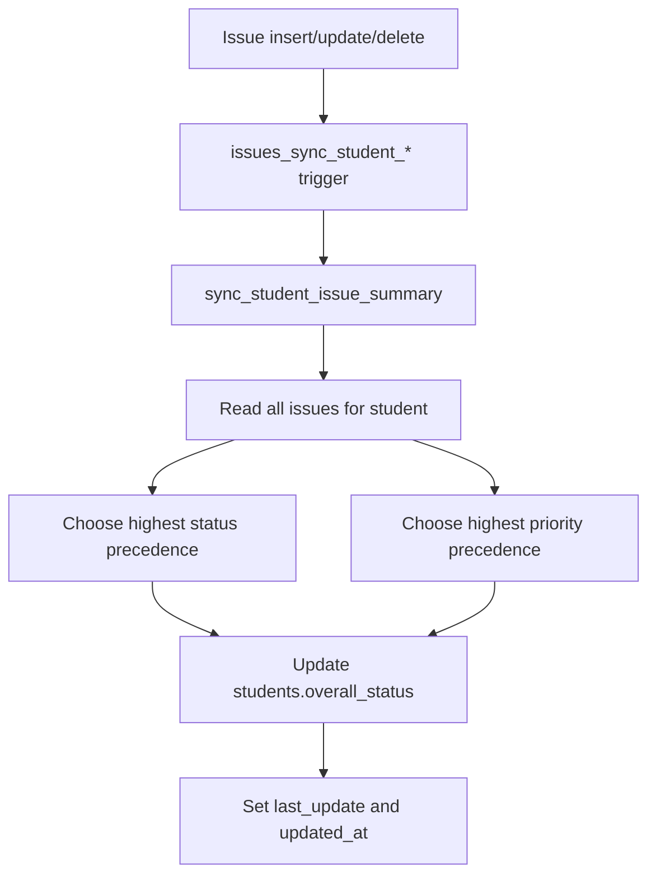

When a student has no remaining issues, the summary function falls back to `Resolved` status and `Low` priority.

## Database Schema Alignment

The SQL schema in `schema.sql` and `supabase/schema.sql` defines these Supabase tables:

| Table | Role |
| --- | --- |
| `courses` | Stores course catalog. |
| `students` | Stores student records and derived status fields. |
| `student_courses` | Many-to-many relationship between students and courses. |
| `issues` | Stores student issues. |
| `comments` | Stores issue/student thread messages. |
| `prompts` | Stores prompt templates. |
| `ai_tools` | Stores AI tool directory records and reserved metric fields. |
| `user_roles` | Legacy role table retained for optional user-management compatibility. |

Database-level automation:

- `set_updated_at` keeps `updated_at` fresh on updates.
- Issue insert/update/delete triggers sync the related student summary.
- Student-role comments can mark a related issue as `Pending`.
- Student comments update the student's `last_update`.
- RLS allows anon/authenticated app access for `SELECT`, `INSERT`, `UPDATE`, and `DELETE` on app tables.
- Realtime publication includes the app tables.
- Seed data lives in `supabase/seed.sql`.

## End-to-End User Flow

The normal operational flow looks like this:

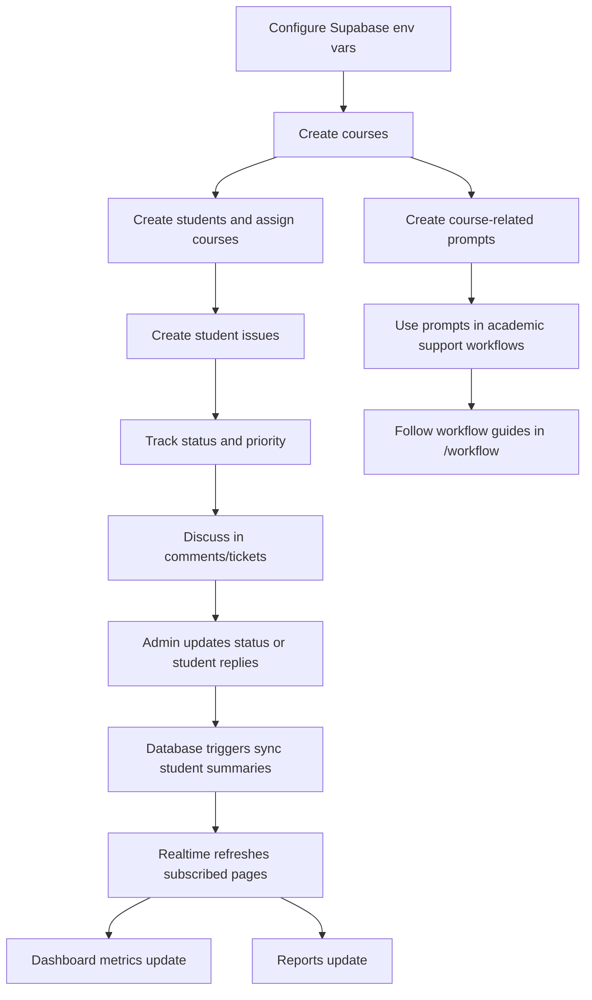

## Current Implementation Notes

- The active app data comes from Supabase through `lib/data` modules.
- Most routes are client components because they use local UI state, event handlers, browser APIs, and `useSupabaseQuery`.
- There is no sample data loaded by default; `supabase/schema.sql` explicitly omits seed data.
- `store/useToastStore.ts` powers toast notifications.
- `store/useAppStore.ts` has been removed; selected issue state lives locally in the comments page.
- Analytics is present as a route shell but hidden from sidebar navigation until real aggregates are added; Settings is read-only apart from its live Supabase connection check.
- AI tool metrics can be created, edited, and deleted from `/tools`.
- The workflow pages (`/workflow`, `/workflow/[slug]`) are server components using static data from `workflow-data.ts` with no Supabase dependency.
- The report PDF export is server-side through `app/api/report/[studentId]/pdf/route.ts` and `@react-pdf/renderer`.
- The global search input filters Students, Issues, and Prompts client-side without navigation or reloads.
- Dashboard routes are open-access; no login or Supabase Auth session is required.
