# System Flow

This document explains the main features in the academic services dashboard and how they connect to each other.

## System Overview

The application is a Next.js App Router dashboard for tracking students, courses, issues, comments, prompts, reports, AI tool metrics, and platform settings.

At runtime, the UI currently uses the shared Zustand store in `store/useAppStore.ts` as the active data layer. The Supabase schema in `schema.sql` and `supabase/schema.sql` defines the matching database structure for persistence, realtime subscriptions, row level security, and automatic student-status syncing.

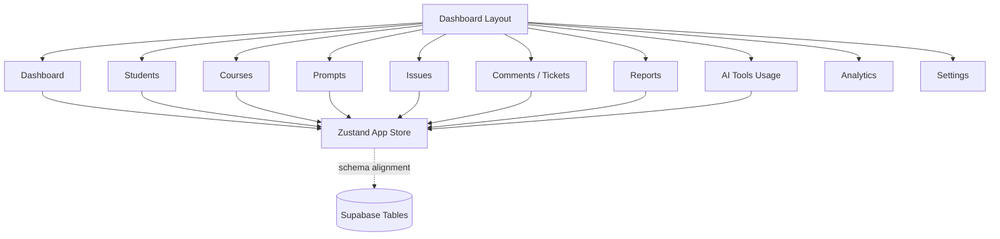

## Core Data Model

The system revolves around these entities:

| Entity | Purpose | Connected To |
| --- | --- | --- |
| Student | Person being tracked for academic progress and support needs. | Courses, Issues, Comments, Reports |
| Course | Academic course or curriculum item. | Students, Prompts |
| Issue | Problem, ticket, or support item tied to a student. | Student, Comments, Dashboard, Reports |
| Comment | Thread message on an issue. | Student, Issue |
| Prompt | Saved prompt/template for work such as assignments, research, presentations, and feedback. | Course optionally |
| AI Tool Usage | Metrics for monitored AI tools. | Dashboard, AI Tools Usage |

## Feature Map

### 1. Dashboard

Route: `/`

The dashboard summarizes the whole system:

| Dashboard Block | Source |
| --- | --- |
| Total students | `students.length` |
| Total courses | `courses.length` |
| Open issues | Issues where status is not `Resolved` |
| Pending reviews | Issues with `Pending` status |
| AI tools usage | Sum of `aiTools.usageCount` |
| Issue category chart | Issues grouped by category |
| Resolution progress chart | Issues grouped by status |
| Recent students table | First five students from the store |

Flow:

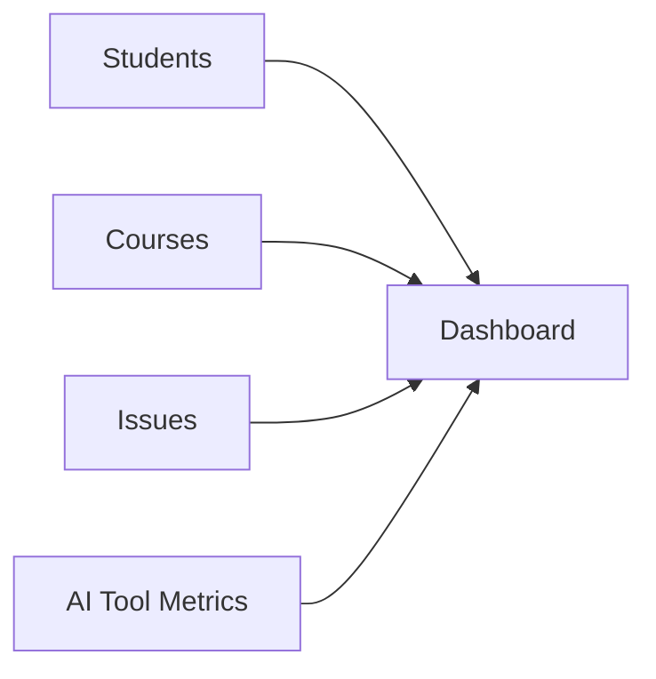

### 2. Students

Route: `/students`

The students page lets an admin:

- View students.
- Search students by name or course.
- Add a new student.
- Assign courses to a student.
- Store trainer, status, email, and notes.
- See each student's issue categories, priority, progress, and latest update.

Create flow:

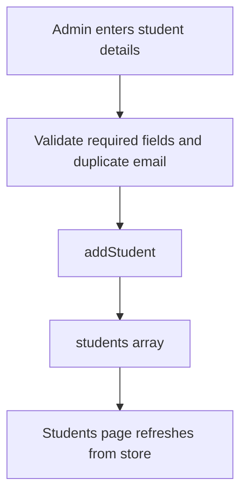

Student issue fields are not entered manually when the student is created. They are recalculated when issues are added or updated.

### 3. Courses

Route: `/courses`

The courses page lets an admin:

- View registered courses.
- Add a course code and title.
- Prevent duplicate course codes.
- See enrollment count by checking student course assignments.

Create flow:

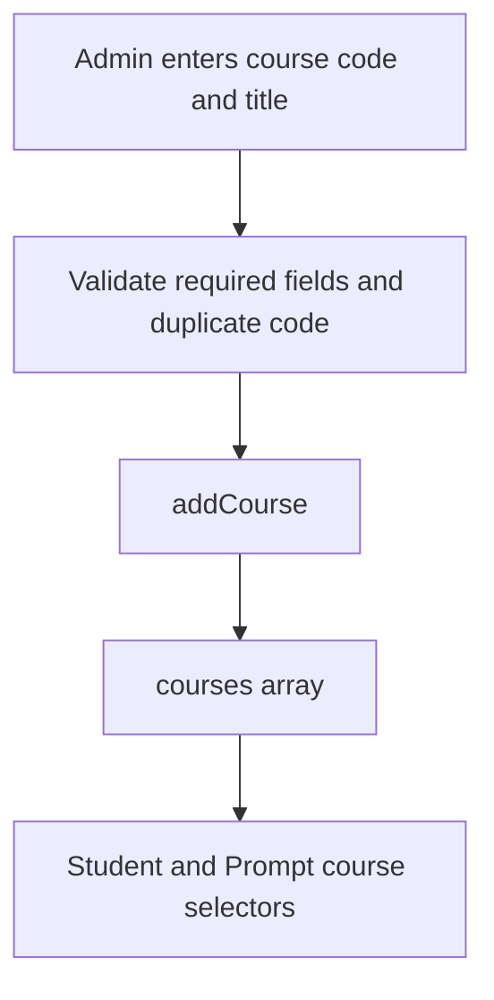

Courses connect to:

- Students through `assignedCourses`.
- Prompts through optional `relatedCourseId`.
- Reports through each student's assigned course list.

### 4. Issues

Route: `/issues`

The issues page displays all tracked student issues and includes the shared new-issue dialog.

An issue has:

- Student
- Category
- Description
- Status
- Priority
- Created date

Create flow:

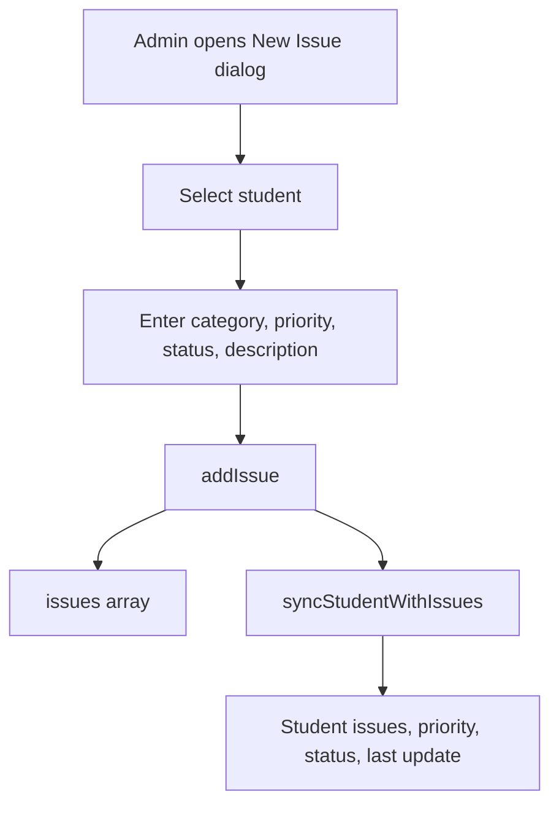

When an issue changes, the related student is recalculated:

- `issues`: unique issue categories for that student.
- `overallStatus`: highest severity issue status.
- `priority`: highest severity priority.
- `lastUpdate`: current timestamp.

### 5. Comments / Tickets

Route: `/comments`

The comments page is the ticket-thread workspace. It lets an admin:

- Select an issue.
- View threaded comments for that issue.
- Reply as `Admin` or `Student`.
- Update an issue status while replying.
- Edit comments.
- Delete comments.
- Create a new issue through the same shared new-issue dialog.

Reply flow:

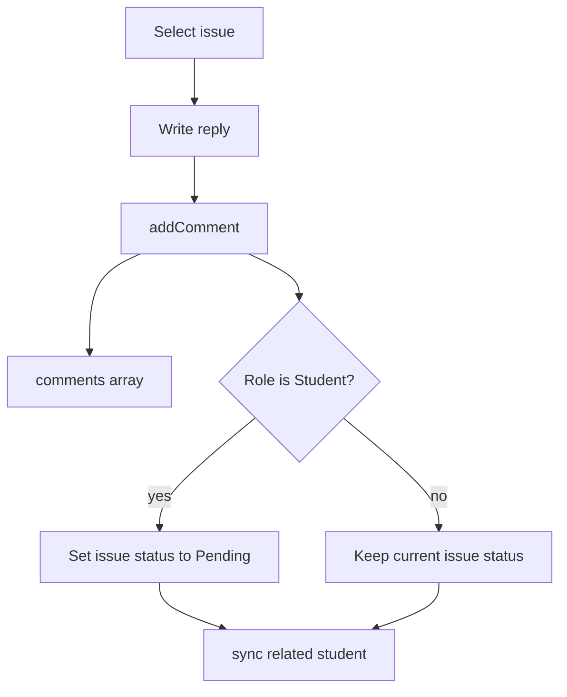

The important connection is that comments are not isolated notes. A student-role comment can reopen or mark an issue as needing attention by setting the issue to `Pending`.

### 6. Prompts

Route: `/prompts`

The prompts page manages reusable prompt templates. It supports:

- Create prompt.
- Edit prompt.
- Delete prompt.
- Search by title, content, category, or tags.
- Filter by category.
- Link a prompt to a course.

Prompt flow:

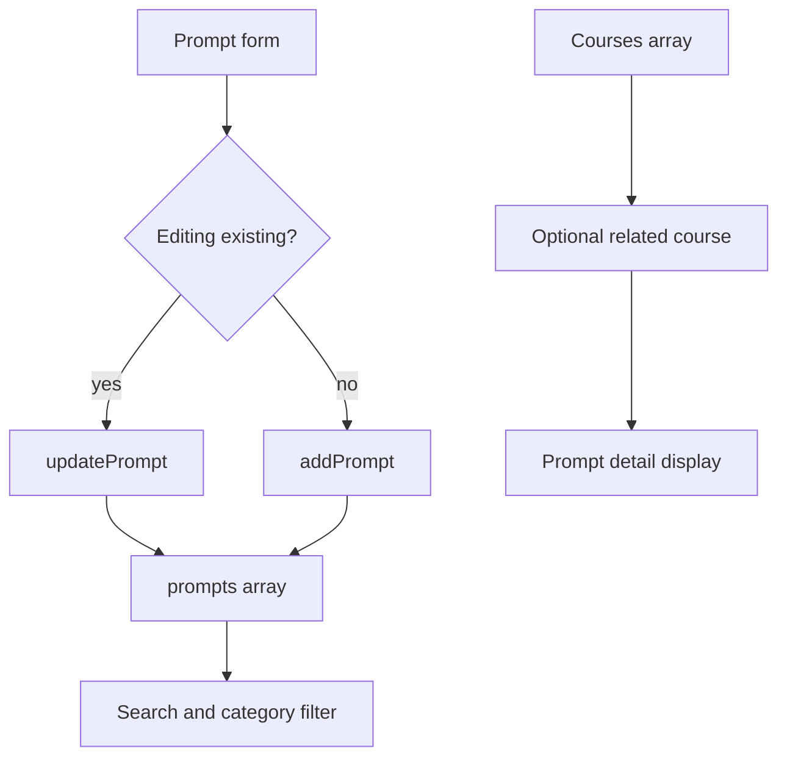

### 7. Reports

Routes:

- `/reports`
- `/reports/[studentId]`

The reports index lists students and summarizes their open issues. Each student links to a detailed report page.

The individual student report aggregates:

- Student profile.
- Assigned courses.
- Issue status summary.
- Issue category summary.
- Full issue table.
- Comment history.
- Timeline-style activity composed from issues and comments.
- AI tools section.

Report flow:

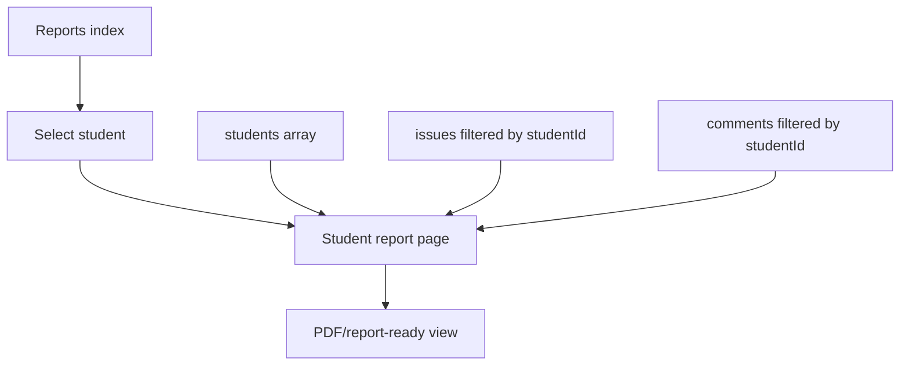

### 8. AI Tools Usage

Route: `/tools`

This page reads AI tool metrics from the store and shows:

- Usage vs related problems chart.
- Tool detail table.
- Usage count.
- Active students.
- Related problem count.
- Success rate.

Flow:

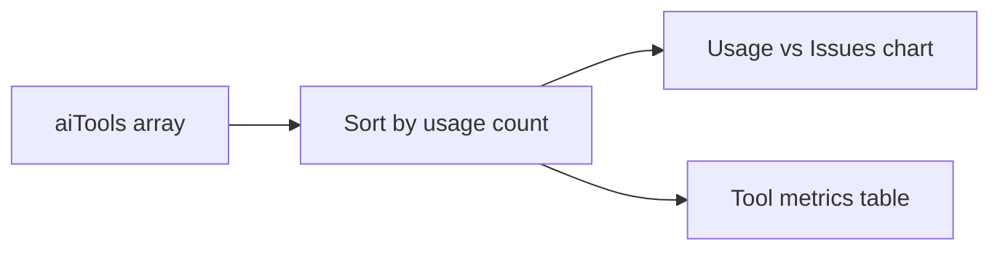

### 9. Analytics

Route: `/analytics`

The analytics page is a placeholder for expanded reporting modules. It does not currently perform calculations beyond displaying the provisioning state.

### 10. Settings

Route: `/settings`

The settings page currently displays platform configuration sections:

- Organization settings.
- Supabase integration status.

The page is read-only in the current implementation.

### 11. Layout, Navigation, Theme, and PWA

Shared layout: `components/layout/dashboard-layout.tsx`

The dashboard layout provides:

- Desktop and mobile sidebar navigation.
- Active-route highlighting.
- Global search input UI.
- Notification indicator based on open issue count.
- Open issue badge in the sidebar.
- Theme toggle.
- PWA install button.
- Admin identity display.

Open issue notification flow:

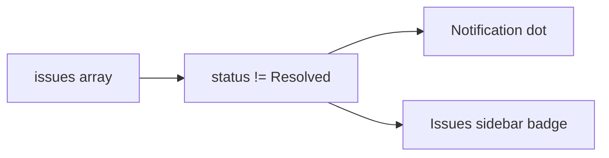

## Store Actions

The active client-side state lives in `store/useAppStore.ts`.

| Action | Updates | Side Effects |
| --- | --- | --- |
| `addStudent` | Adds a student. | Starts with no issues, zero progress, and current `lastUpdate`. |
| `addCourse` | Adds a course. | Normalizes course code to uppercase. |
| `addIssue` | Adds an issue. | Recalculates the related student's issue summary. |
| `updateIssueStatus` | Updates one issue status. | Recalculates the related student's issue summary. |
| `addComment` | Adds a comment. | If role is `Student`, sets the related issue to `Pending` and recalculates student summary. |
| `updateComment` | Updates comment text. | No issue status change. |
| `removeComment` | Removes a comment. | No issue status change. |
| `addPrompt` | Adds a prompt. | Sets `createdAt` and `updatedAt`. |
| `updatePrompt` | Updates a prompt. | Refreshes `updatedAt`. |
| `removePrompt` | Deletes a prompt. | Removes it from the prompt list. |

## Student Status Sync Logic

Student status is derived from issues. The system ranks status and priority values, then stores the highest severity values on the student record.

Status rank:

| Rank | Status |
| --- | --- |
| 0 | Resolved |
| 1 | In Progress |
| 2 | Pending |
| 3 | Escalated |

Priority rank:

| Rank | Priority |
| --- | --- |
| 0 | Low |
| 1 | Medium |
| 2 | High |
| 3 | Critical |

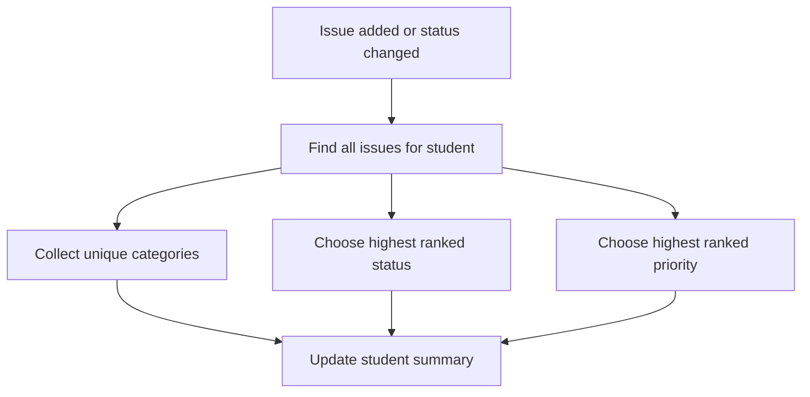

## Database Schema Alignment

The SQL schema defines these Supabase tables:

| Table | Role |
| --- | --- |
| `courses` | Stores course catalog. |
| `students` | Stores student records and derived status fields. |
| `student_courses` | Many-to-many relationship between students and courses. |
| `issues` | Stores student issues. |
| `comments` | Stores issue/student thread messages. |
| `prompts` | Stores prompt templates. |
| `ai_tools` | Stores AI tool usage metrics. |

Database-level automation:

- `set_updated_at` keeps `updated_at` fresh on updates.
- Issue insert/update/delete triggers sync the related student summary.
- Student comments can mark an issue as `Pending`.
- RLS is enabled with broad public app policies in the current schema.
- Realtime publication includes the app tables.

## End-to-End User Flow

The normal operational flow looks like this:

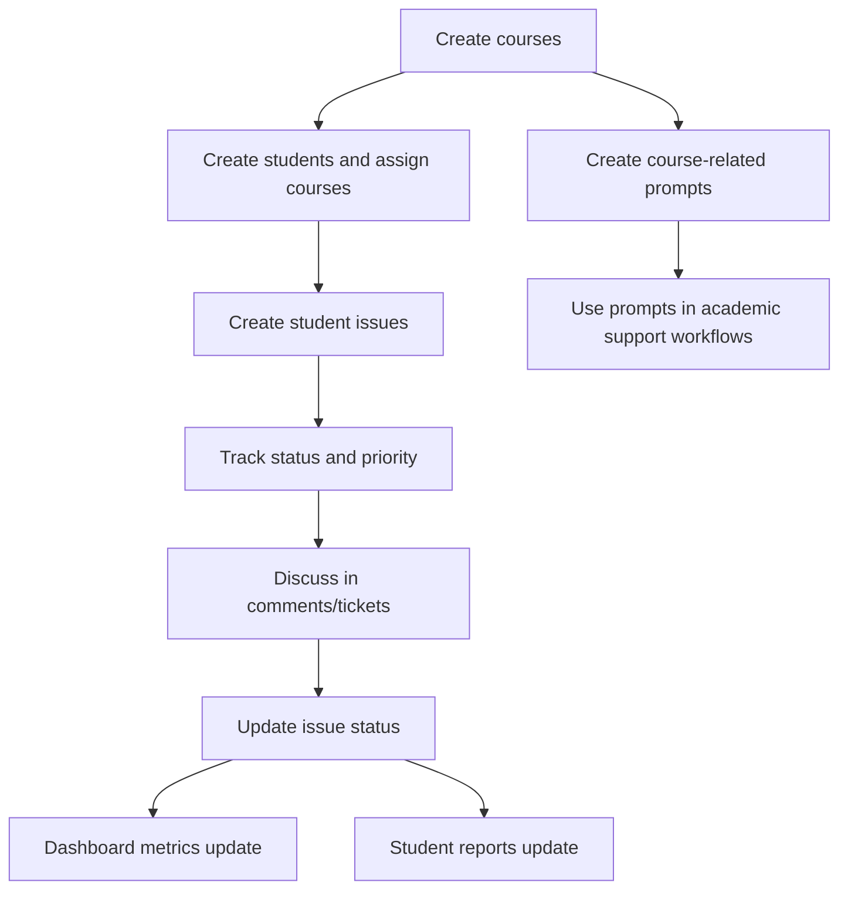

## Current Implementation Notes

- The active app state starts empty; no sample records are loaded by default.
- The UI currently uses Zustand state directly.
- Supabase client setup exists in `lib/supabase.ts`, and SQL schemas are present, but the pages do not yet load or mutate Supabase records directly.
- Analytics and Settings are present as route shells, with advanced analytics and editable configuration still to be implemented.
- AI tool metrics are modeled in the store and database schema, but there is currently no UI action for creating or editing tool metrics.
