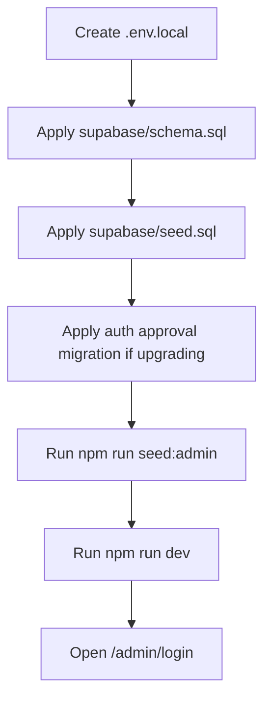
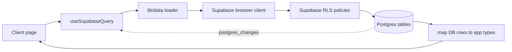
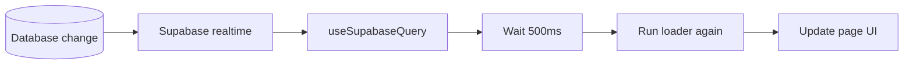
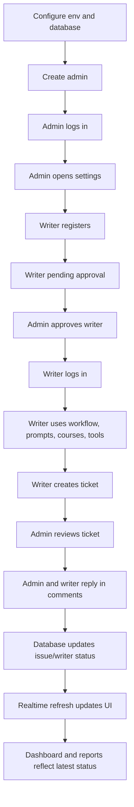

# TDS Management Workflow

This document explains how the TDS Management app works from setup to daily use. It is written as a workflow guide: what happens first, who performs each action, which route or file handles it, and how data moves through the system.

## 1. High-Level System Flow

TDS Management is a Next.js 16 App Router dashboard backed by Supabase Auth, Supabase Postgres, Row Level Security, and realtime database subscriptions.

```mermaid
flowchart TD
  User[User opens app] --> Proxy[proxy.ts route protection]
  Proxy --> Session{Supabase session exists?}
  Session -- No --> Login[/login or /admin/login]
  Session -- Yes --> Profile[/api/auth/me]
  Profile --> Status{Approval status}
  Status -- pending --> Pending[/pending-approval]
  Status -- rejected/disabled --> Denied[/access-denied]
  Status -- approved --> Role{User role}
  Role -- admin --> Admin[Admin workspace]
  Role -- student --> Writer[Writer expert workspace]
  Admin --> Pages[Dashboard pages]
  Writer --> WriterPages[Allowed writer pages]
  Pages --> Data[lib/data helpers]
  WriterPages --> Data
  Data --> Supabase[(Supabase tables + RLS)]
  Supabase -. realtime .-> Pages
  Supabase -. realtime .-> WriterPages
```

The app has two user roles:

| Role | Main Purpose |
| --- | --- |
| `admin` | Manages the full operation: writers, courses, issues, comments, prompts, reports, AI tools, and user approvals. |
| `student` | Represents a writer expert account with limited access to workflow, prompts, courses, issues, comments, and tools. |

The app has four approval states:

| Status | Meaning |
| --- | --- |
| `pending` | Account exists but cannot enter the app yet. |
| `approved` | Account can access role-allowed pages. |
| `rejected` | Account is blocked and routed to `/access-denied`. |
| `disabled` | Account is blocked and routed to `/access-denied`. |

## 2. Setup Workflow

Before users can work in the app, the system needs Supabase configuration, schema, seed data, and at least one admin account.



Required environment variables:

```text
NEXT_PUBLIC_SUPABASE_URL=...
NEXT_PUBLIC_SUPABASE_ANON_KEY=...
SUPABASE_SERVICE_ROLE_KEY=...
```

Important setup files:

| File | Purpose |
| --- | --- |
| `supabase/schema.sql` | Main database schema, enums, tables, triggers, indexes, RLS, and realtime publication. |
| `supabase/seed.sql` | Baseline seed data for approved AI tools. |
| `supabase/auth-approval-migration.sql` | Adds/repairs approval-aware auth fields for existing databases. |
| `scripts/ensure-default-admin.mjs` | Creates or repairs the default admin account. |

## 3. Authentication And Approval Workflow

### Writer Registration

Writer experts register from `/register`. New writer accounts always start as pending.

```mermaid
flowchart TD
  RegisterForm[/register form] --> RegisterApi[/api/auth/register]
  RegisterApi --> Validate[Validate name, email, password]
  Validate --> AuthUser[Create Supabase Auth user]
  AuthUser --> StudentRow[Create students row]
  StudentRow --> RoleRow[Create user_roles row]
  RoleRow --> Pending[/pending-approval]
```

The registration API:

1. Validates name, email, and password.
2. Creates a Supabase Auth user.
3. Creates a linked `students` row.
4. Creates a `user_roles` row with `role = student` and `status = pending`.
5. Sends the user to `/pending-approval`.

Main implementation:

| File | Responsibility |
| --- | --- |
| `app/register/page.tsx` | Writer registration form. |
| `app/api/auth/register/route.ts` | Creates auth user, writer row, and pending role row. |
| `app/pending-approval/page.tsx` | Waiting room until admin approval. |

### Login

Admin and writer login use the same login component with different expected roles.

```mermaid
flowchart TD
  LoginForm[Login form submit] --> Clear[Sign out existing session]
  Clear --> Password[Supabase signInWithPassword]
  Password --> Profile[/api/auth/me]
  Profile --> RoleMatch{Expected role matches?}
  RoleMatch -- No --> Error[Sign out and show error]
  RoleMatch -- Yes --> Status{Status}
  Status -- approved admin --> Dashboard[/]
  Status -- approved student --> Workflow[/workflow]
  Status -- pending --> Pending[/pending-approval]
  Status -- rejected/disabled --> Denied[/access-denied]
```

Login routes:

| Route | Expected Role | Destination After Approval |
| --- | --- | --- |
| `/admin/login` | `admin` | `/` |
| `/login` | `student` | `/workflow` |

Main implementation:

| File | Responsibility |
| --- | --- |
| `components/auth/login-card.tsx` | Shared login form, role checking, redirects. |
| `app/api/auth/me/route.ts` | Returns the current authenticated profile. |
| `lib/auth/server.ts` | Reads Supabase session and `user_roles`. |
| `lib/auth/use-current-user-role.ts` | Client hook for role-aware UI. |

### Route Protection

`proxy.ts` protects pages before they render.

| User State | Result |
| --- | --- |
| No session on admin route | Redirect to `/admin/login?next=...` |
| No session on writer route | Redirect to `/login?next=...` |
| Pending account | Redirect to `/pending-approval` |
| Rejected or disabled account | Redirect to `/access-denied` |
| Approved admin | Can access admin and shared pages |
| Approved writer | Can access writer-allowed pages only |

## 4. Navigation Workflow

After login, `components/layout/dashboard-layout.tsx` builds the shell and filters sidebar links by role.

Admin navigation:

```text
Dashboard
Writers
Reports
Courses
Prompts
Workflow
Issues
Comments & Tickets
AI Tools
Settings
```

Writer navigation:

```text
Courses
Prompts
Workflow
Issues
Comments & Tickets
AI Tools
```

Public pages do not show the dashboard shell:

```text
/login
/admin/login
/register
/pending-approval
/access-denied
```

## 5. Data Loading Workflow

Most pages load data through the same pattern:



Step by step:

1. A page calls `useSupabaseQuery()`.
2. The hook calls a loader from `lib/data/*`.
3. The loader uses `requireSupabase()` to create the browser Supabase client.
4. Supabase RLS decides what the signed-in user can read or mutate.
5. Raw database rows are mapped into UI types by `lib/data/mappers.ts`.
6. The page renders loading, error, or data UI.
7. Realtime table changes trigger a debounced refresh.

Core data modules:

| Module | Handles |
| --- | --- |
| `lib/data/students.ts` | Writer CRUD and course assignments. |
| `lib/data/courses.ts` | Course CRUD and enrollment counts. |
| `lib/data/issues.ts` | Issue list, creation, and status updates. |
| `lib/data/comments.ts` | Ticket comments, replies, edit, delete. |
| `lib/data/prompts.ts` | Prompt library CRUD. |
| `lib/data/ai-tools.ts` | AI tools directory CRUD. |
| `lib/data/dashboard.ts` | Dashboard and reports aggregate loaders. |
| `lib/data/hooks.tsx` | Loading, error, refresh, and realtime subscription logic. |

## 6. Admin Daily Workflow

Admins operate the full system.

```mermaid
flowchart TD
  AdminLogin[/admin/login] --> Dashboard[/ dashboard]
  Dashboard --> ManageWriters[/students]
  Dashboard --> ManageCourses[/courses]
  Dashboard --> ManageIssues[/issues]
  Dashboard --> TicketDesk[/comments]
  Dashboard --> Prompts[/prompts]
  Dashboard --> Reports[/reports]
  Dashboard --> Tools[/tools]
  Dashboard --> Settings[/settings]
  Settings --> ApproveUsers[Approve/reject/disable users]
```

Admin responsibilities:

| Area | Route | What Admin Can Do |
| --- | --- | --- |
| Dashboard | `/` | View metrics, issue status, recent writers. |
| Writers | `/students` | Create, edit, delete writers and assign courses. |
| Courses | `/courses` | Create, edit, delete courses. |
| Issues | `/issues` | View all issues and create tickets for writers. |
| Comments & Tickets | `/comments` | Reply, edit/delete comments, change ticket status. |
| Prompts | `/prompts` | Create, edit, delete prompt templates. |
| Reports | `/reports` | View writer reports and export PDFs. |
| AI Tools | `/tools` | Maintain approved AI tools. |
| Settings | `/settings` | Manage account roles and approval status. |

Admin-only mutations call `assertAdmin()` or server-side `requireAdminRequest()`.

## 7. Writer Expert Daily Workflow

Writer experts have a limited workspace after admin approval.

```mermaid
flowchart TD
  WriterRegister[/register] --> Pending[/pending-approval]
  Pending --> AdminApproval[Admin approves in /settings]
  AdminApproval --> WriterLogin[/login]
  WriterLogin --> Workflow[/workflow]
  Workflow --> Prompts[/prompts]
  Workflow --> Courses[/courses]
  Workflow --> Issues[/issues]
  Issues --> Comments[/comments]
  Workflow --> Tools[/tools]
```

Writer permissions:

| Area | Route | What Writer Can Do |
| --- | --- | --- |
| Workflow | `/workflow` | Read assignment workflows and copy guide text. |
| Prompts | `/prompts` | Read prompt templates. |
| Courses | `/courses` | See assigned courses. |
| Issues | `/issues` | Create and view own issues. |
| Comments & Tickets | `/comments` | Comment on own tickets. |
| AI Tools | `/tools` | Read approved tool directory. |

Writer accounts cannot manage users, delete shared data, or access admin-only reports/settings.

## 8. Issue And Ticket Workflow

Issues and comments form the support ticket system.

```mermaid
flowchart TD
  NewIssue[Create issue] --> AuthCheck{Approved admin or own writer account?}
  AuthCheck -- No --> Error[Show authorization error]
  AuthCheck -- Yes --> InsertIssue[(issues row)]
  InsertIssue --> IssueTrigger[Database trigger updates writer status]
  IssueTrigger --> Realtime[Realtime refreshes pages]
  Realtime --> Thread[/comments ticket thread]
  Thread --> Reply[Add comment]
  Reply --> CommentAuth{Allowed to comment?}
  CommentAuth -- No --> Error
  CommentAuth -- Yes --> InsertComment[(comments row)]
  InsertComment --> StudentComment{Comment role is Student?}
  StudentComment -- Yes --> MarkPending[Set issue status to Pending]
  StudentComment -- No --> Refresh[Refresh thread]
  MarkPending --> IssueTrigger
```

Issue rules:

| Actor | Issue Creation Rule |
| --- | --- |
| Approved admin | Can create an issue for any writer. |
| Approved writer | Can create an issue only for their linked writer account. |
| Pending/rejected/disabled user | Cannot create issues. |

Comment rules:

| Actor | Comment Rule |
| --- | --- |
| Approved admin | Can comment, edit comments, delete comments, and update ticket status. |
| Approved writer | Can comment only on their own ticket. Comment role is forced to `Student`. |
| Pending/rejected/disabled user | Cannot comment. |

Database automation:

| Trigger | Result |
| --- | --- |
| Issue insert/update/delete | Recalculates writer `overall_status`, `priority`, and `last_update`. |
| Student comment insert | Marks the related issue as `Pending`. |

Main implementation:

| File | Responsibility |
| --- | --- |
| `app/issues/page.tsx` | Issue table and status view. |
| `app/comments/page.tsx` | Ticket queue, thread, reply composer. |
| `components/issues/new-issue-dialog.tsx` | Shared issue creation dialog. |
| `lib/data/issues.ts` | Issue reads, create, status update. |
| `lib/data/comments.ts` | Comment reads, create, update, delete. |
| `supabase/schema.sql` | Issue/comment triggers and RLS policies. |

## 9. Reports Workflow

Reports turn writer, course, issue, and comment data into an admin-readable summary.

```mermaid
flowchart TD
  ReportsIndex[/reports] --> SelectWriter[Select writer]
  SelectWriter --> Detail[/reports/:studentId]
  Detail --> LoadData[Load writer, courses, issues, comments]
  LoadData --> UIReport[Render report page]
  UIReport --> Pdf[/api/report/:studentId/pdf]
  Pdf --> ApprovedCheck[Require approved user]
  ApprovedCheck --> ServiceRole[Use service-role Supabase client]
  ServiceRole --> RenderPdf[Render PDF]
  RenderPdf --> Download[Download file]
```

Main implementation:

| File | Responsibility |
| --- | --- |
| `app/reports/page.tsx` | Report index. |
| `app/reports/[studentId]/page.tsx` | Writer report detail. |
| `app/api/report/[studentId]/pdf/route.ts` | Server-side PDF export. |

## 10. User Management Workflow

Admins approve and manage accounts in `/settings`.

```mermaid
flowchart TD
  Settings[/settings] --> LoadUsers[/api/users GET]
  LoadUsers --> RequireAdmin[requireAdminRequest]
  RequireAdmin --> ListAuth[Supabase auth.admin.listUsers]
  RequireAdmin --> ListRoles[user_roles]
  Settings --> UserAction[Approve / reject / disable / change role / delete]
  UserAction --> UserApi[/api/users/:userId]
  UserApi --> ServiceRole[Service-role client]
  ServiceRole --> UpdateRole[user_roles]
  ServiceRole --> UpdateMetadata[Auth metadata]
```

Server API routes:

| Route | Purpose |
| --- | --- |
| `GET /api/users` | List auth users joined with role/status data. |
| `POST /api/users` | Invite or create a managed user flow. |
| `PATCH /api/users/[userId]` | Update role/status. |
| `DELETE /api/users/[userId]` | Remove user role row and auth account. |

Safety rule: an admin cannot remove their own admin access or delete their own account.

## 11. Static Workflow Guide Pages

The assignment workflow section is different from the database-backed pages. It is static app content.

```mermaid
flowchart TD
  WorkflowIndex[/workflow] --> StaticCards[workflowCards]
  StaticCards --> Detail[/workflow/:slug]
  Detail --> WorkflowData[app/workflow/workflow-data.ts]
  WorkflowData --> Steps[Step cards]
  WorkflowData --> PromptBlocks[Prompt blocks]
  PromptBlocks --> CopyButton[Copy workflow text]
```

Main implementation:

| File | Responsibility |
| --- | --- |
| `app/workflow/page.tsx` | Workflow library index. |
| `app/workflow/[slug]/page.tsx` | Workflow detail pages. |
| `app/workflow/workflow-data.ts` | Static workflow content. |
| `app/workflow/_components/copy-workflow-button.tsx` | Clipboard copy action. |

## 12. Realtime Refresh Workflow

Pages subscribe to the tables that affect their visible data. When Supabase emits `postgres_changes`, the page refreshes after a 500ms debounce.



Common subscriptions:

| Page | Realtime Tables |
| --- | --- |
| Dashboard | `students`, `student_courses`, `courses`, `issues`, `comments`, `ai_tools` |
| Writers | `students`, `student_courses`, `courses`, `issues` |
| Courses | `courses`, `student_courses` |
| Issues | `issues`, `students`, `comments` |
| Comments & Tickets | `students`, `issues`, `comments` |
| Prompts | `courses`, `prompts` |
| Reports | `students`, `student_courses`, `courses`, `issues`, `comments` |
| AI Tools | `ai_tools` |
| Workflow | None; static content |

## 13. Complete Operational Flow

This is the normal end-to-end lifecycle.



## 14. Quick File Map

| Concern | Main Files |
| --- | --- |
| Route protection | `proxy.ts` |
| Login and registration | `components/auth/login-card.tsx`, `app/register/page.tsx`, `app/api/auth/register/route.ts` |
| Current user profile | `app/api/auth/me/route.ts`, `lib/auth/server.ts`, `lib/auth/roles.ts`, `lib/auth/use-current-user-role.ts` |
| Dashboard layout | `components/layout/dashboard-layout.tsx` |
| Data loading | `lib/data/hooks.tsx`, `lib/data/client.ts`, `lib/data/*` |
| Issues and comments | `app/issues/page.tsx`, `app/comments/page.tsx`, `components/issues/new-issue-dialog.tsx` |
| Reports | `app/reports/page.tsx`, `app/reports/[studentId]/page.tsx`, `app/api/report/[studentId]/pdf/route.ts` |
| User management | `app/settings/page.tsx`, `app/api/users/route.ts`, `app/api/users/[userId]/route.ts` |
| Database rules | `supabase/schema.sql`, `supabase/auth-approval-migration.sql` |

